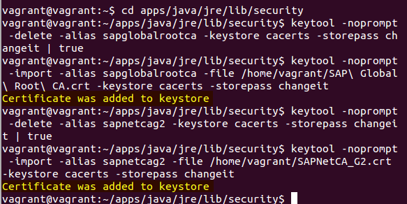

## Add SAPNetCa Certificate to Java Keystore

- Step 1: Open the terminal in the virtual machine from the side bar


- Step 2: Copy and paste the following codes in the terminal, then hit enter.
```
cd ~
wget http://aia.pki.co.sap.com/aia/SAP%20Global%20Root%20CA.crt 
cd apps/java/jre/lib/security
keytool -noprompt -delete -alias sapglobalrootca -keystore cacerts -storepass changeit | true
keytool -noprompt -import -alias sapglobalrootca -file /home/vagrant/SAP\ Global\ Root\ CA.crt -keystore cacerts -storepass changeit
keytool -noprompt -delete -alias sapnetcag2 -keystore cacerts -storepass changeit | true
keytool -noprompt -import -alias sapnetcag2 -file /home/vagrant/SAPNetCA_G2.crt -keystore cacerts -storepass changeit
```
You should be able to see that a list of command and two SAPNetCa certificates are added to the keystore.

