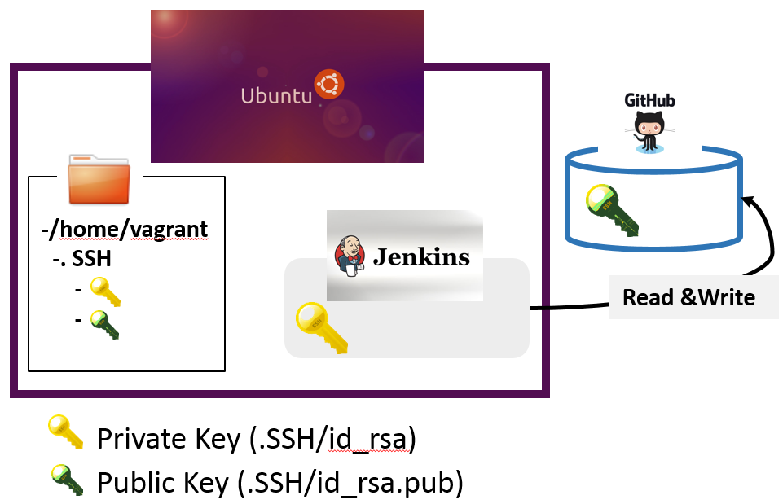
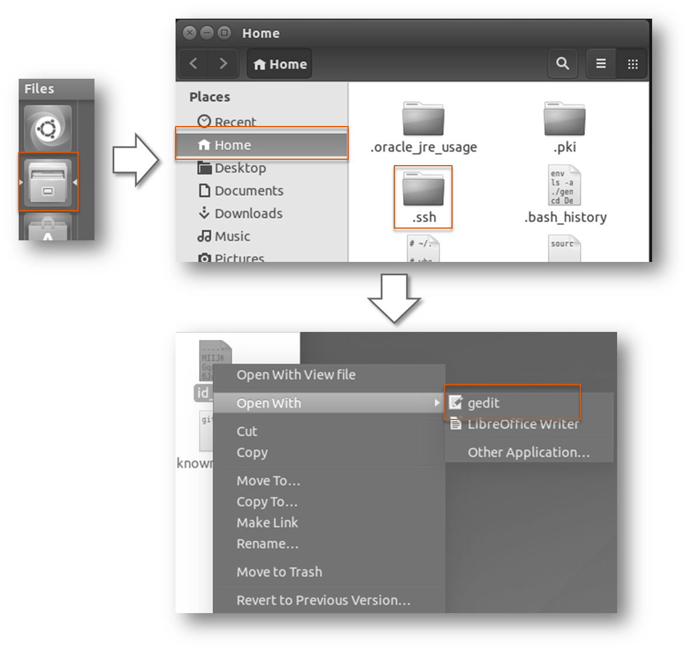
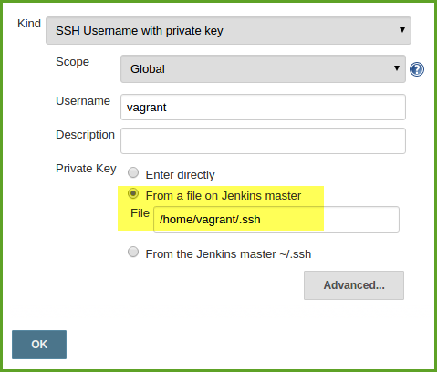
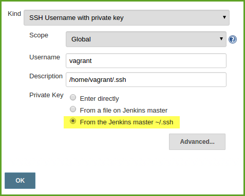

# SSH Connection in VM setting

## Illustration of the connection and the use of ssh keys

## Three ways to add private key to Jenkins
- Enter directly
  - Start the virtual machine which you have installed
  - Open the file browser, navigate to `Home/.ssh/`, right click on the file `id_rsa` and select `Open With -> gedit`

  - Copy the complete content of the file (the private key)
  - Navigate to the root/main page of your Jenkins Server
  - Navigate to `Credentials`
 
  

  - Click on `Global credentials (unrestricted)`
  - On the left side click on `Add Credentials`
  - As `Kind` select `SSH Username with private key`
  - Select the radio button `Enter directly` in section `Private Key`
  - Paste your private key into the text field

  - Press the button `OK`
- Give the path of the `.SSH` folder
  - Click on `Global credentials (unrestricted)`
  - On the left side click on `Add Credentials`
  - As `Kind` select `SSH Username with private key`
  - Select the radio button `From a file on Jenkins master` in section `Private Key`
  - Enter the absolute path to the .ssh file. 

- Use the default `~/.SSH` folder
 - Click on `Global credentials (unrestricted)`
  - On the left side click on `Add Credentials`
  - As `Kind` select `SSH Username with private key`
  - Select the radio button `From the Jenkins master ~/.ssh` in section `Private Key`

 

