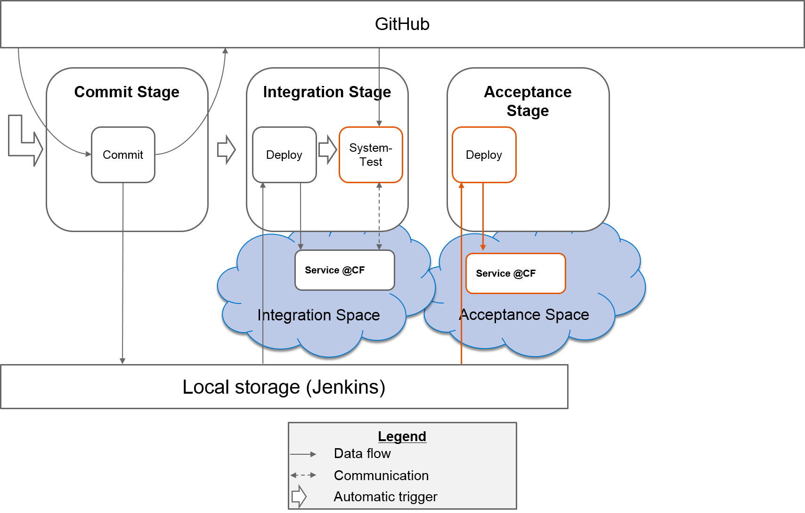
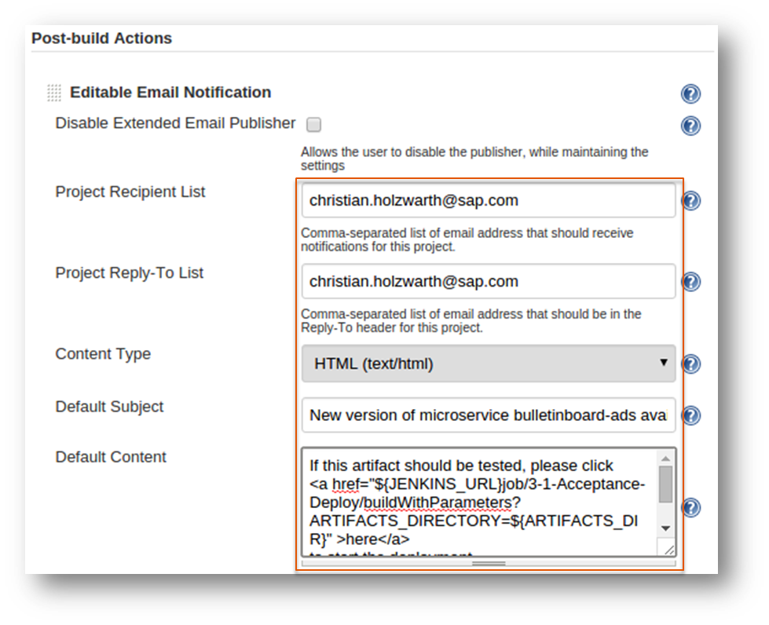
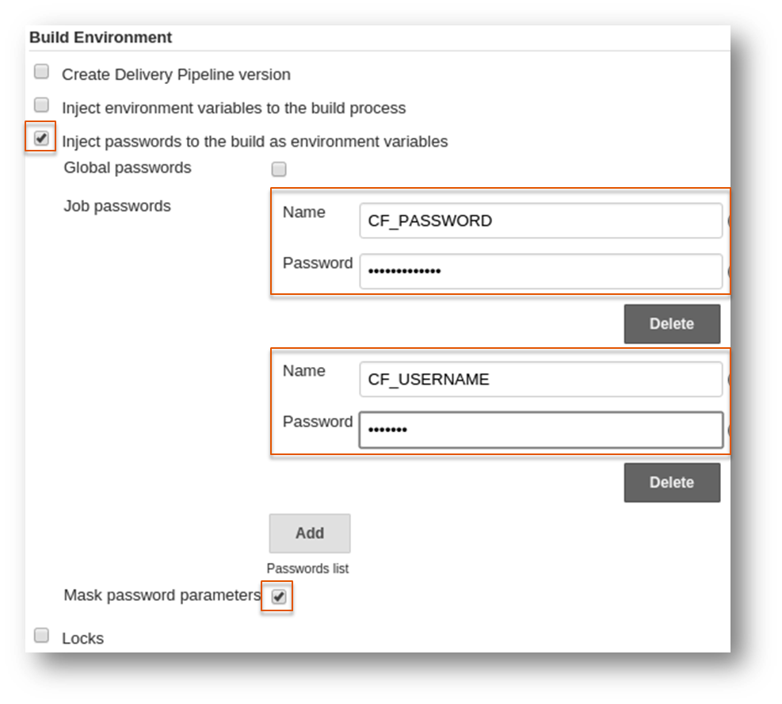

#Exercise: Acceptance Stage Part 1 - Deploy

##Content
In this exercise you will create the job `3-1-Acceptance-Deploy`. This job is responsible for the deployment of the built artifact into the acceptance space. In order to use the archived artifact from the job `1-1-Commit` and to deploy it, you will add an archive directory parameter which points to the built artifact. With this information you can copy the artifact into the workspace of this job (`3-1-Acceptance-Deploy`) and upload it to Cloud Foundry.

**Remark: We don't want to deploy every commit into the acceptance space automatically/immediately when we test manually**. Think about following scenario: 
- A developer pushes a new commit
- This commit passes all stages until the integration stage successfully
- The deployment to the acceptance space will be triggered and the testers will start their work
- During the test phase an other commit passes the integration stage also successfully and will be deployed to the acceptance space while the manual tests are performed!

In case you do manual testing in the acceptance stage, the owner/responsible person of the acceptance stage should decide whether a new artifact will be deployed to the acceptance space and be tested or not. Therefore you will send an e-mail to these responsible person with a link inside. With a click on this link the deploy job (`3-1-Acceptance-Deploy`) will be triggered. The e-mail will be send if the job `2-2-Integration-Systemtest` was performed successfully.

##Overview




##Step 1: Edit job `2-2-Integration-Systemtest` and send E-Mail 
When the system tests were successfull, you will trigger an e-mail to owner/responsible person of the acceptance stage who decides whether this artifact should be tested or if we wait until another artifact was generated. The e-mail contains a hyperlink which triggers the next job (`3-1-Acceptance-Deploy`) which you will create in step 2 of this exercise.
###Step 1.1: Configure the job to send an email 
- Configure job `2-2-Integration-Systemtest`
- Add post-build action `Editable Email Notification`
- Insert your e-mail in field `Project Recipient List` and `Project Reply-To List`
- As `Content Type` select `HTML (text/html)`
- Add a subject to field `Default Subject`
```
New version of microservice bulletinboard-ads available
```
- Add text to field `Default Content`:
```HTML
If this artifact should be tested, please click 
<a href="${JENKINS_URL}job/3-1-Acceptance-Deploy/buildWithParameters?ARTIFACTS_DIR=${ARTIFACTS_DIR}" >here</a>
to start the deployment.
</br>
```



- Press button `Advanced Settings...`
- In sub-section `Triggers` press button `Remove Trigger`
- Press button `Add Trigger` and select `Success`
- Press button `Delete` to remove the `Developers`
- Press button `Add` and select `Recipient List` if this is not there already.
- Save the job

###Step 1.2: Add a `manual step`  
Although we decide to trigger the `3-1-Acceptance-Deploy` job manually, it is still part of our pipeline. 
- Click `Add post-build action` and choose `Build other projects(manual step)`. Enter `3-1-Acceptance-Deploy`. Don't worry if there is a warning that the project doen't exist, we will create it in the next few steps. 

*Note* If you check the dependency graph in your job, you can see that there is a line between `2-2-Integration-Systemtes` and `3-1-Acceptance-Deploy`

##Step 2: Create new Job `3-1-Acceptance-Deploy`

###Step 2.1: Create Job
- Navigate to the root/main page of your Jenkins Server
- Navigate to the view you have created (`CD-Pipeline`)
- Create a new `Freestyle Project` and name it `3-1-Acceptance-Deploy`
- Check `This build is parameterized`, add a `String parameter` and name it `ARTIFACTS_DIR`

###Step 2.2: Deploy to Acceptance Space

- In section `Build` press the button `Add Buildstep`, then select `Execute Shell` and copy/paste the following code (**Hint**: Replace `<place-holder>` accordingly): 

```SHELL
mkdir -p target
echo $ARTIFACTS_DIR

cp $ARTIFACTS_DIR/target/bulletinboard-ads.war target
cp $ARTIFACTS_DIR/manifest.yml .

cf --version
cf login -u <CF_USERNAME> -p <CF_PASSWORD> -a https://api.cf.sap.hana.ondemand.com -o <your-org-name> -s <your-acceptance-space-name>
cf services
cf create-service postgresql-9.4-lite free postgres-bulletinboard-ads
cf create-service rabbitmq-3.5.6-lite free bulletinboard-mq
cf push -n bulletinboard-ads-acceptance-<your-id>
```
- Continue with step 2.3

###Step 2.3: Send e-mail notification to testers
When the deploy was successfull, we want to trigger an e-mail to the testers.

- Add post-build action `Editable Email Notification`
- Insert your e-mail in field `Project Recipient List` and `Project Reply-To List`
- Add a subject to field `Default Subject`
```
Please test a new version of microservice bulletinboard-ads
```
- As `Content Type` select `HTML (text/html)`
- Add text to field `Default Content`(**Hint**: Replace `<place-holder>` with your own information):
```HTML
Link to the microservice: <a href="https://bulletinboard-ads-acceptance-<your-id>.cfapps.sap.hana.ondemand.com" > https://bulletinboard-ads-acceptance-<your-id>.cfapps.sap.hana.ondemand.com </a> 
</br>
</br>
After successfull test click 
<a href="${JENKINS_URL}job/3-2-Acceptance-Release/buildWithParameters?ARTIFACTS_DIR=${ARTIFACTS_DIR}" >here</a>

```
- Press button `Advanced Settings...`
- In sub-section `Triggers` press button `Remove Trigger`
- Press button `Add Trigger` and select `Success`
- Press button `Delete` to remove the `Developers`
- Press button `Add` and select `Recipient List` - If this is not there already
- Save the job
 
###Step 2.4: Add a `manual step`  
- Click `Add post-build action` and choose `Build other projects(manual step)`. Enter `3-2-Acceptance-Release`. Don't worry if there is a warning that the project doen't exist, we will create it in the next exercise. 
 
##Step 3: trigger pipeline
- Perform a dummy change in your forked repository to see how the pipeline works

*NOTE:*
When you trigger the job by clicking the hyperlink in the email, you will see a blank page is opened. Although no information is shown that the downstream job has begun, when you check the jenkins server, you can see the job running. Ideally it would be great if we can be redirected to the job page. However, this function is no longer supported by the newer version of Jenkins. You can check out the issue [here](https://issues.jenkins-ci.org/browse/JENKINS-22865). 

A work around is provided in the [optional exercise- Build Job via Jenkins API](Optional-Exercise-Build_Job_via_Jenkins_API.md)


#Appendix
## Workaround if there are memory limitations
**Hint**: Because of memory limitations, you will use your own trial space as acceptance space

- In section `Build Environment` check the box `Inject passwords to the build as environment variables`
  - Ensure that the box `Mask password parameters` is checked
  - Click the button `Add`
  - Enter `CF_PASSWORD` as `Name` and your CF passord as `Password`
  - Click the button `Add`
  - Enter `CF_USERNAME` as `Name` and your d/i number as `Password`




- In section `Build` press the button `Add Buildstep`, then select `Execute Shell` and copy/paste the following code:
```SHELL
mkdir -p target
echo $ARTIFACTS_DIR

cp $ARTIFACTS_DIR/target/bulletinboard-ads.war target
cp $ARTIFACTS_DIR/manifest.yml .

cf --version
cf login -u ${CF_USERNAME} -p ${CF_PASSWORD} -a https://api.cf.sap.hana.ondemand.com -o trial -s ${CF_USERNAME}
cf services
cf create-service postgresql-9.4-lite free postgres-bulletinboard-ads
cf create-service rabbitmq-3.5.6-lite free bulletinboard-mq
cf push -n bulletinboard-ads-acceptance-${CF_USERNAME}
```
- Continue with step 2.3
