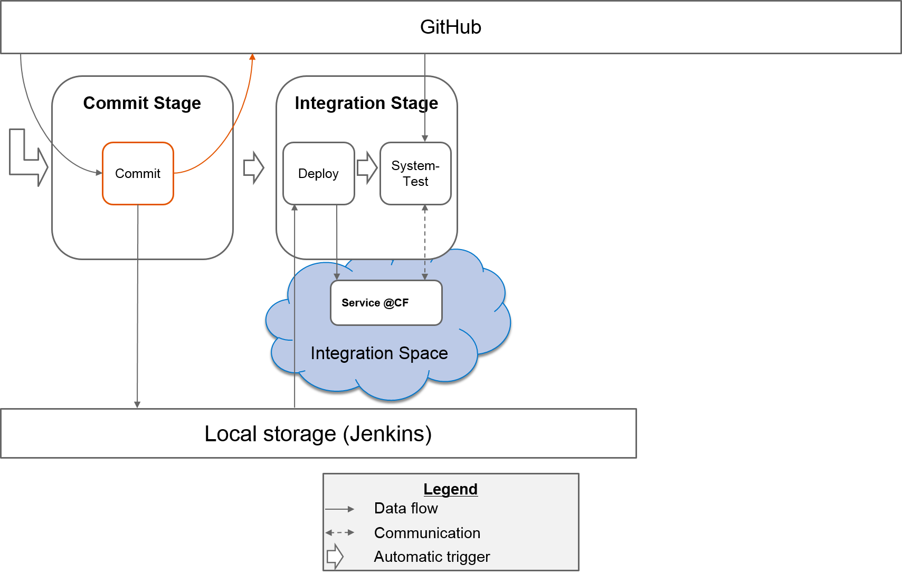
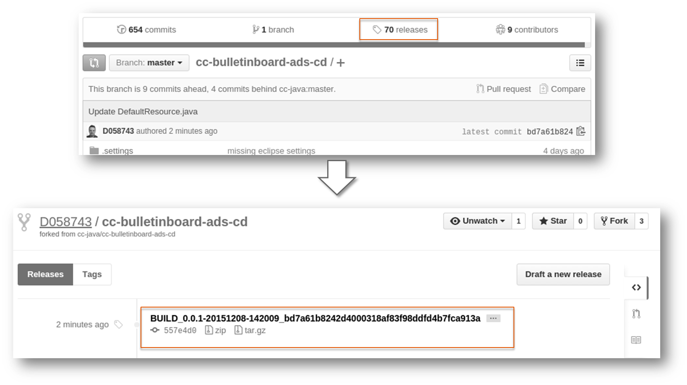
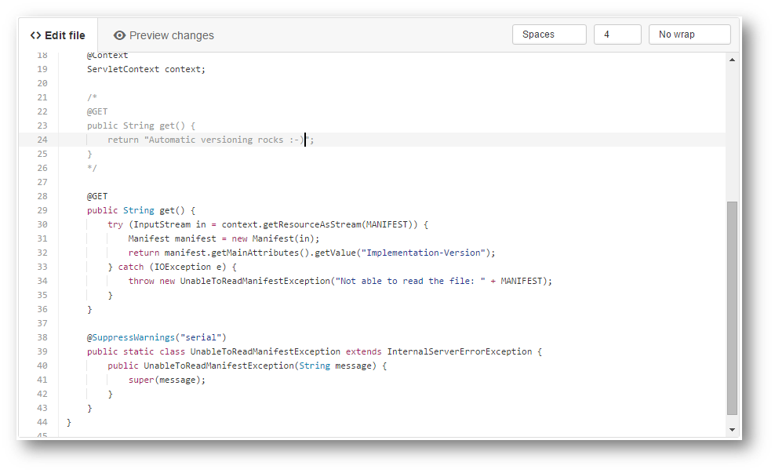
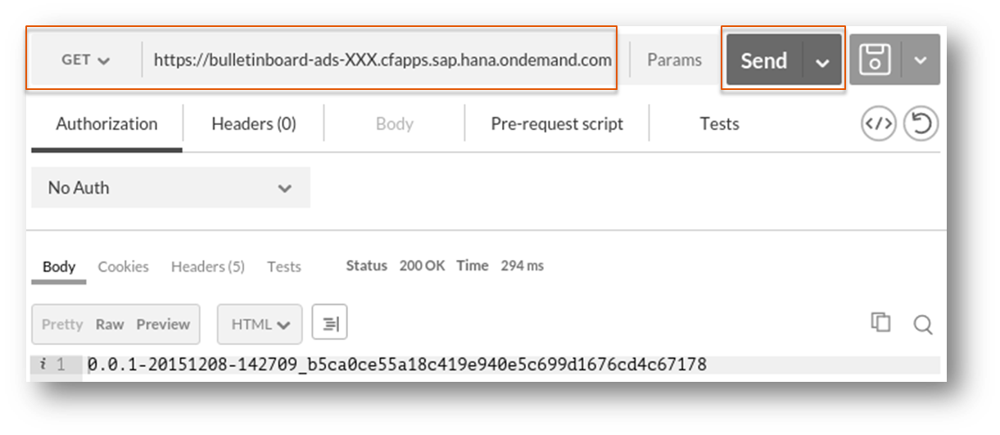
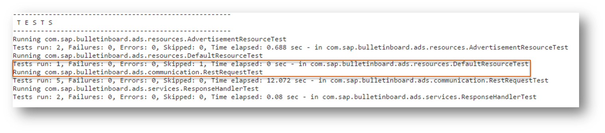

#Exercise: Automated Versioning

##Content
In this exercise you will enhance the job `1-1-Commit` by the functionality to perform the automatic versioning. In order to do that you will finally call a ruby script which sets the version automatically. After the version is changed, you will set a tag and push the change to your forked GitHub project.

Additionally you will provide the version via the default resource.

**Hint**: We set the version in job `1-1-Commit` because we want to build only once. If we set the version in a later state, we have to build and qualify again.

##Overview



##Step 1: Set Version in pom.xml
###Step 1.1: Version using Jenkins build number
- Modify job `1-1-Commit`
- In section `Pre Steps` press the button `Add pre-build step` and select `Execute Shell`
- Copy/paste the following command:

```SHELL
mvn versions:set -DnewVersion=${BUILD_NUMBER}
```

- Save the configuration
- Start job `1-1-Commit` manually
- Inspect the log. Additional you can have a look into the pom.xml file within the workspace


###Step 1.2: Version using timestamp and commit id
- Modify job `1-1-Commit`
- In section `Pre Steps` -> `Execute Shell` remove the mvn command from the previous step (`mvn versions:set -DnewVersion=${BUILD_NUMBER}`) and copy/paste the following commands:

```SHELL
env

ruby ./scripts/set_version.rb
export ARTIFACT_VERSION=`sed 's/ARTIFACT_VERSION=\(.*\)/\1/' version.properties`
```

- Save the configuration
- Start job `1-1-Commit` manually
- Inspect the log. Additional you can have a look into the pom.xml file within the workspace

##Step 2: Push to GitHub
- Modify job `1-1-Commit`
- To push the changes made in the file `pom.xml` to GitHub, append the following lines to the shell script:
```SHELL
git add pom.xml
git commit -m "update version"
git tag "BUILD_$ARTIFACT_VERSION"
git push origin "BUILD_$ARTIFACT_VERSION"
```

- Save the configuration

##Step 3: Test the automatic versioning

###Step 3.1: Perform a change in the GitHub project
- Navigate to your forked GitHub project and open the file  `/src/main/java/com/sap/bulletinboard/ads/resources/DefaultResource.java`
- Press the "pen-button" to edit the file
- Change the return value of the method `public String get()` to `"Automatic versioning rocks :-)"`
- Press the button `Commit Changes` - this saves your changes
- Switch to your Jenkins
- After max one minute the job `1-1-Commit` should run
- Wait until job `2-2-Integration-Systemtest` was executed successfully
- Optional: Call your microservice with postman (A GET call to the default resource -> The response text should be changed to `Automatic versioning rocks :-)`)

###Step 3.2: Inspect Tags in GitHub
- Navigate to your forked GitHub  Project
- Click on `Releases`. There should be a new Tag




##Step 4: Provide the version in the default resource

###Step 4.1: Change Coding
- Navigate to your forked GitHub project and open the file  `/src/main/java/com/sap/bulletinboard/ads/resources/DefaultResource.java`
- Press the "pen-button" to edit the file
- Comment the `@Get` Method out and the outcomment code in. Your code should look like this:



- Press the button `Commit Changes` - this saves your changes
- Switch to your Jenkins
- Wait until job `2-1-Integration-Deploy` was executed successfully
- Open Postman
- Select `GET` and paste the URL to your app (**Hint**: You must use the HTTPS protocol)
- Send the request. As response the version of the microservice should be returned




###Step 4.2 [Optional]: Unit Test for DefaultResource
- Analyze the log of the job `1-1-Commit`
- In the Test section you will notice that two test are skipped. Both Unit test are for the Default Resource



- Remove the `@Ignore` annotation, so that the Test will be executed. Therefore:
   - Open the file `/src/test/java/com/sap/bulletinboard/ads/resources/DefaultResourceTest.java`
   - Delete the `@Ignore` annotation
   - Commit your change
   - Open the file `/src/test/java/com/sap/bulletinboard/ads/resources/DefaultResourceIT.java`
   - Delete the `@Ignore` annotation
   - Commit your change


