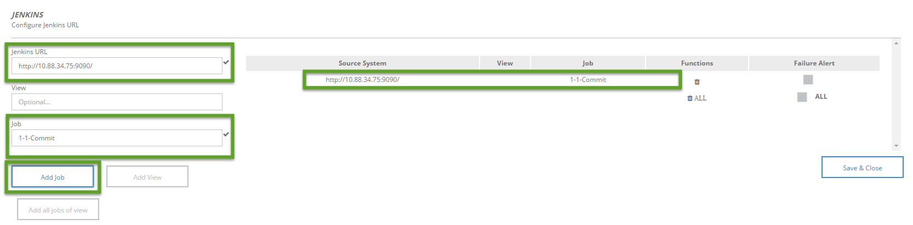

#Exercise: Use Bridge Client for Traffic Light

##Content
In this exercise, you will set up a traffic light which reflects the status of your pipeline.  

#Step 1: Install Bridge Client and Jenkins App
- In your own PC, install and start Bridge Client [here](https://github.wdf.sap.corp/bridge/bridge-client/). **NOTE** The Bridge Client should be installed in your local PC instead of the VM, because traffic light will be connected to your own PC. 
- Open the [Bridge](https://bridge.mo.sap.corp/#/) in the browswer in your own PC. Click "+" and search for `Jenkins` in the pop up page. Click `Add` to include Jenkins in your Bridge dashboard.

#Step 2: Configure Jenkins to include the job you want to build. 
- Open the `Command Prompt` in your local machine. Run `ipconifg` and mark the `IPv4 Address` and copy it.

- Click on the settings button in the Jenkins app in Bridge. 
- In the left column of the pop-up enter the Jenkins URL`http://<Your IPv4 Address>:9090/`. You will see a tick appearing besides the input field if the address is valid.
- Add `1-1-Commit` as the job then you will see the job listed in the right column. 

#Step 3: Monitor the status of traffic light
- Go to your virtual machine and build the Jenkins job. Your traffic light should show green which can also be monitored in the Bridge interface.
- Go to your git repository and find the project you forked: `cc-bulletinboard-ads-cd`. Navigate yourself to the test folder. Find one test class and edit it. Change the content of one `assertThat` to fail the test. For example, go to `AdvertisementResourceIT.java`, change the first test case's assertion ` assertThat(getAll(), hasSize(1));` into ` assertThat(getAll(), hasSize(2));`. Then, commit the changes. 
- Your job should be triggered by the new commit. Monitor whether the traffic light reflects the new result of your build.

