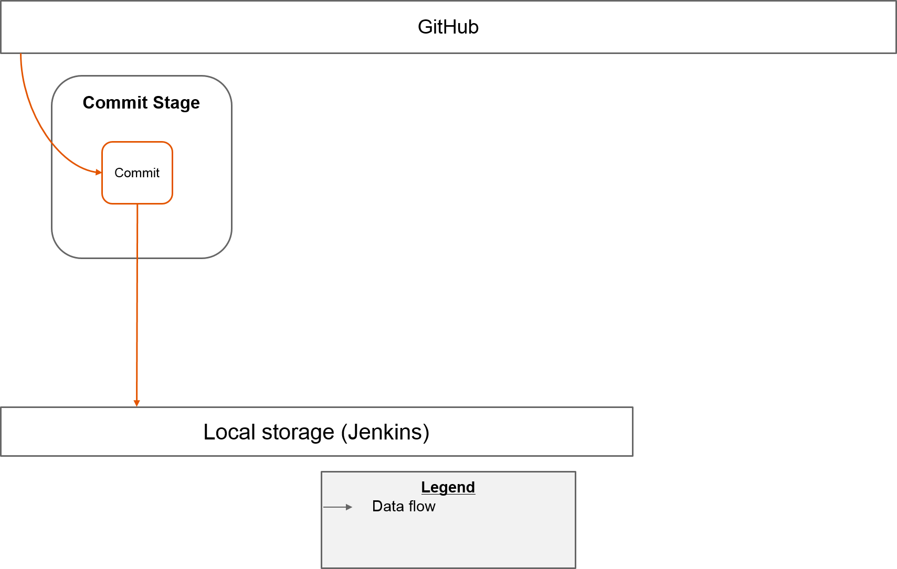
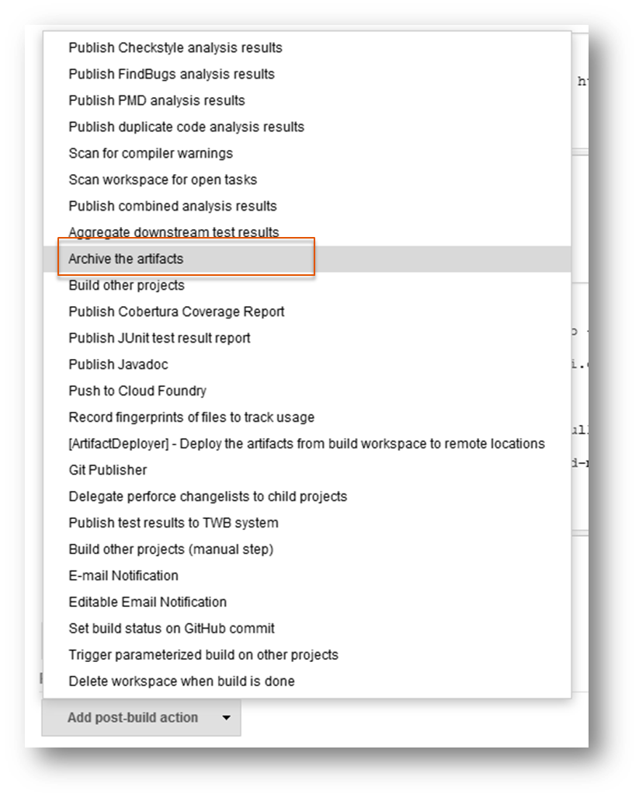
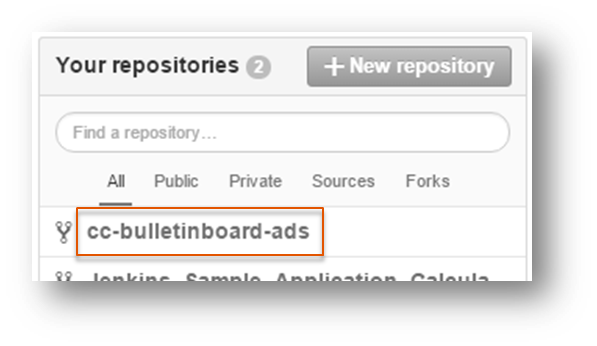

# Exercise: CI Job in Commit Stage

##Content
In this exercise you will create the job for the commit stage. This job is responsible to synchronize the GitHub repository, to perform some tests (e.g. Unit tests) and to build the artifact. In later exercises you will make use of this artifact to perform further tests and at least, if all tests are successful, you will deploy it to the production space. After the build you will archive the built artifact in order to reuse it for further jobs which you will define in further exercises.

**Hint**: Later, you will enhance this job by the functionality to update the version of the artifact as well as enhance it by some further tests (e.g. code coverage).

##Overview

##Step 1: Create Job

- Go to the start page of your Jenkins server
- On the upper left side click on `New Item` to create a new job
- Select `Maven project` and give the name `1-Commit`
- Press the `OK` button
- Configure the job:
  - If you have multiple JDKs installed, select the one that you have configured in the central configuration. If the section `JDK` is not displayed, only one JDK is installed and set automatically
  - In section `Source Code Management` select the radio button `Git` and:
    - enter the SSH-Link to your forked GitHub project (**Hint**: you can find the howto guide at the end of this page in the appendix)
    - define the branch `master` if you are asked to specify a branch
    - as `Credentials` select `github`
  - In section `Build` define `clean verify` as `Goals and options`
- Keep the configuration open and proceed with step 2 (Pass artifacts between jobs)
 
##Step 2: Pass artifacts between jobs

Now we're going to archive the built artifacts. This allows another job to safely access those artifacts, without the risk of the commit job's workspace being modified at the same time.

  * In section `Post-build Actions` press the button `Add post-build action`, select `Archive the artifacts` and enter `target/*.war,*manifest*.yml,pom.xml, scripts/*,version.properties` as files to archive. This is necessary because we want to build only once and reuse the artifact by other stages

* Save the job
 
##Step 3: Inspect the console Log
- Run the job by clicking the "Build Now" button
- Inspect/analyse the console log

#Appendix
##Copy SSH link to a GitHub repository
- Open this [link to GitHub](https://github.wdf.sap.corp/) in a new browser tab
- Login if you aren't
- On the right side of the window select your forked repository

 

- Copy the SSH link

 
