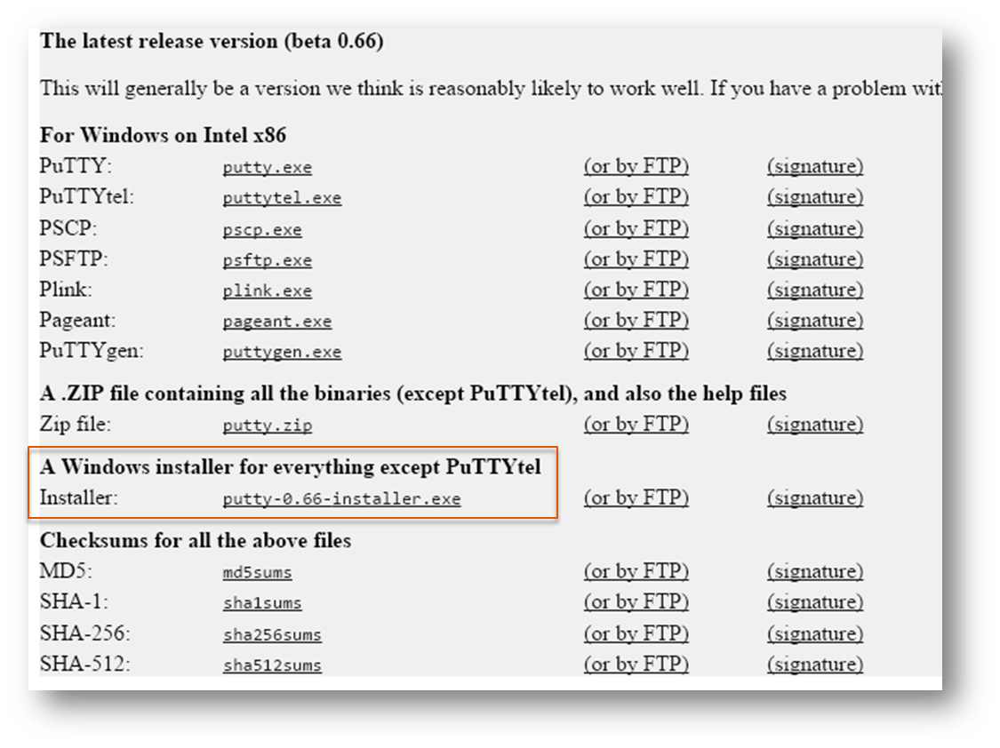
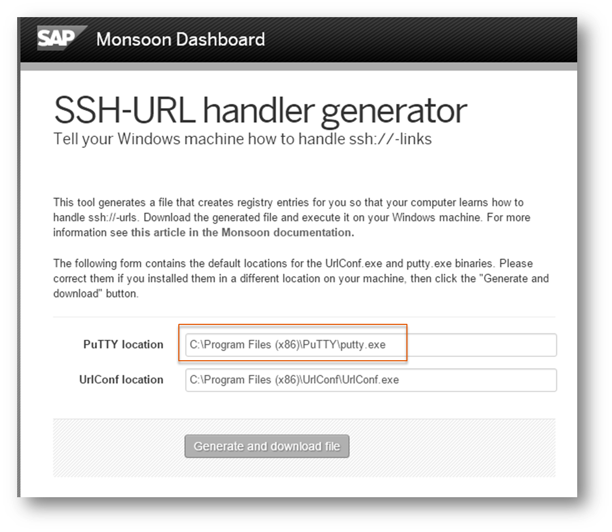
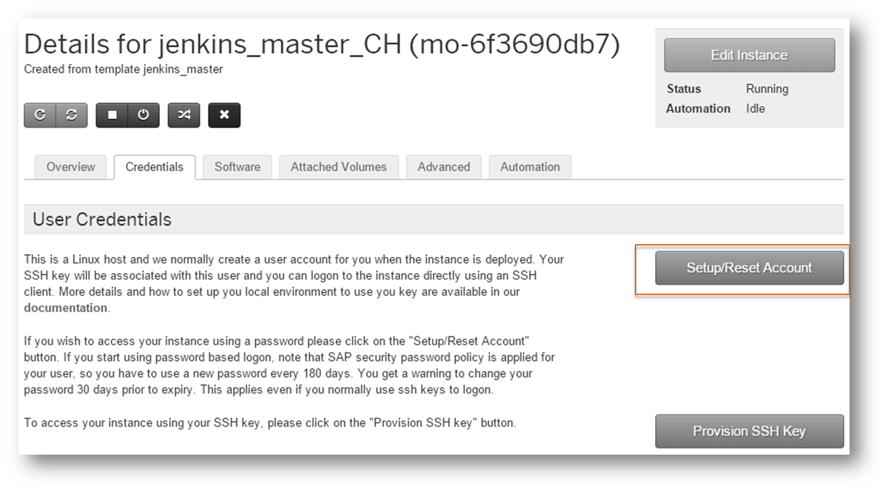
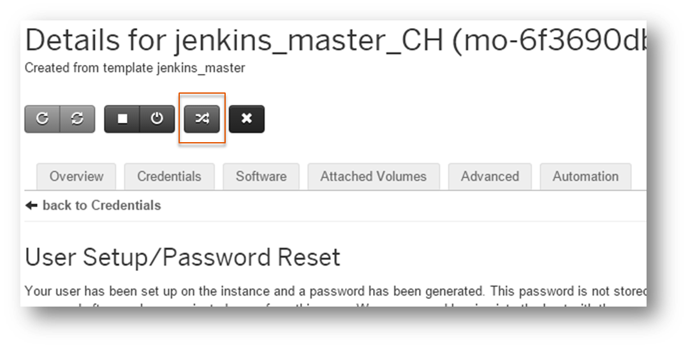
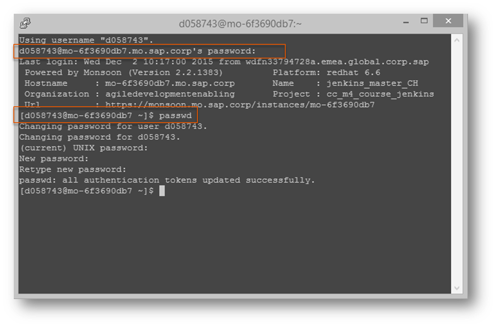
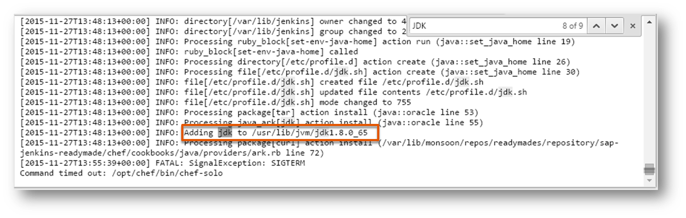
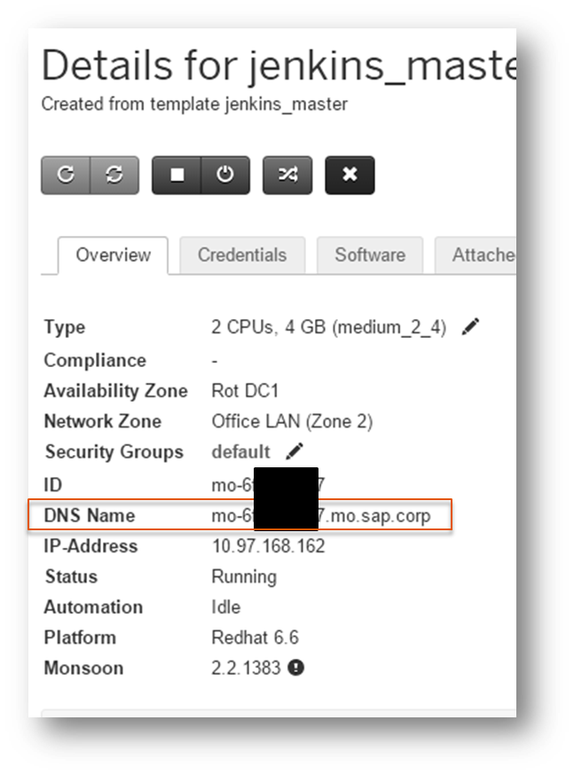

# Exercise: Create Jenkins Server On Monsoon

##Content
In this exercise you will create a Jenkins server on Monsoon. Additional you will install the Cloud Foundry Client on your generated Jenkins server.

##Step 1: Create Jenkins

Follow the guide [here](https://wiki.wdf.sap.corp/wiki/download/attachments/1563161749/RSR_Monsoon_HowTo_CreateSystem_By_ReadyMade.pdf?api=v2) - But consider the following  **remarks**:
- Slide 3: Use the public key from the virtual machine (~~or from your local pc/laptop~~)
- Slide 6: In the section `Automation -> Attributes` paste the following JSON:
```JSON
{
  "sap_jenkins": {
    "user": "tomcat",
    "applicationName": ""
  },
  "activate_security": {
    "activate": true
  },
  "sap-jenkins-addons": {
    "java": {
      "flavor": "oracle",
      "version": "8"
    }
  }
}
```
**Hint**: The default version for Java is 7 (see [here](https://github.wdf.sap.corp/sapsolutions/sap-jenkins-addons/blob/master/attributes/java.rb))
- Slide 8: We will later come to this point (Step 4). So do not perform


**If you get an error that the certificate cannot be installed, just ignore it and go ahead**

##Step 2: Enable SSH connection to work with the console on Jenkins
We need to enable the SSH connection, because we want to install the Cloud Foundry Client on our Jenkins server (Step 3)

###2.1: Windows
####Step 2.1.1: Prepare connection
- Navigate to [https://monsoon.mo.sap.corp/organizations](https://monsoon.mo.sap.corp/organizations)
- Select your organisation and your project
- Click on the instance you've created
- Follow the instructions [here](https://monsoon.mo.sap.corp/docs/troubleshooting/#ssh-action) (Perform only section: SSH links in the Dashboard do not work as expected). **Hint**: In case you run on Windows, select the windows installer to install Putty. Additional: If you use the `SSH-URL handler generator` please make sure that the paths to PuTTY and UrlConf are correct. Otherwise it won't work





If this doesn't work for you, you can try this: https://monsoon.mo.sap.corp/docs/technical-setup/ssh-setup

###Step 2.1.2: Connect and set your own password
- Navigate to tab `Credentials` and click on the button `Setup/Reset Account`



- Down at the page you can find your password (keep this in mind or copy it)
- Click on the button with the crossing arrows to connect via SSH



- After the PuTTY window has opened, type in your password to login (**Hint**: If you have copied your pwd, you can paste it via right click on your mouse). After successful login, type the command `passwd`. This enables you to define your own password



- Close PuTTY 

###2.2 SSH-Connections on Linux
####Open SSH in Terminal 
- Open Monsoon page
- Open a terminal in Linux
- Enter `ssh <username>@<host>` into the terminal, where `<username>` is located under Credentials in Monsoon details page. `<host>` is the DNS name located under Overview in Monsoon details page.
- Enter yes if prompted for fingerprint
- Enter the password located under Credentials in Monsoon details page when prompted.
Credentials in Monsoon details page

####Register SSH-Links to automatically open a ssh-terminal (Chromium, ...)
**Might fail with `The specified location is not mounted`**
- Check that ssh-links are not currently handled `xdg-mime query default x-scheme-handler/ssh`
- Create a file ssh-handler.sh in your user-directory
```SHELL
#!/bin/sh
d=${1#ssh://}
gnome-terminal -e "ssh $d" &
```
- Make it executable ` chmod a+x ssh-handler.sh`
- Create a file ssh-handler.desktop
```
[Desktop Entry]
Type=Application
Name=SSH Handler
Exec=/home/vagrant/ssh-handler.sh %u
Icon=utilities-terminal
StartupNotify=false
MimeType=x-scheme-handler/ssh;
```
- Set this file as your handler for ssh-links `xdg-mime default ssh-handler.desktop x-scheme-handler/ssh`

####Register SSH-Links to automatically open a ssh-terminal (Firefox)
- open about:config
- right-click on New, Boolean
- network.protocol-handler.expose.ssh
- set value to false
- then click an ssh-link
- Choose an application, select ssh-handler.sh
 
# Skip Step 3, 4 and 5. Go directly to step 6 !

##~~Step 3: Install CF Client~~
- Navigate to [https://monsoon.mo.sap.corp/organizations](https://monsoon.mo.sap.corp/organizations)
- Select your organisation and your project
- Click on the instance you've created
- Open the SSH connection to your Jenkins (Like in step 2.2) and login
- Execute the following commands (copy them and paste them via right click on your mouse):
```SHELL
wget "https://cli.run.pivotal.io/stable?release=redhat64&version=6.14.0&source=github-rel" -O cfinstall.rpm
sudo rpm -i cfinstall.rpm
```

**Hint**: The current CFI version can be found [here](http://help.sap.com/disclaimer?site=https://github.com/cloudfoundry/cli/releases ) 


##~~Step 4: Install Ruby~~
~~Follow the instructions [here](https://github.wdf.sap.corp/cc-java-dev/cc-devops-coursematerial/blob/master/Internal/Redhat_Ruby_Installation_Guide.md)~~

##~~Step 5: Copy the path of the JDK installation~~
- Navigate to [https://monsoon.mo.sap.corp/organizations](https://monsoon.mo.sap.corp/organizations)
- Select your organisation and your project
- Click on the instance you've created
- Switch to tab `Automation`
- Click on the button `Show Automation History`
- Click on `log`. A new browser tab should open
- Search for `Adding jdk to` - If there is no match, search for `JDK`



- Copy the path to the installed JDK (e.g.: `/usr/lib/jvm/jdk1.8.0_65`) and paste it somwhere, because we need this path later in Exercise 2 (Preparation and Basics)

##Step 6: Open Jenkins UI
- Navigate to [https://monsoon.mo.sap.corp/organizations](https://monsoon.mo.sap.corp/organizations)
- Select your organisation and your project
- Click on the instance you've created
- In the list, you can find the `DNS Name` of your Jenkins server



- Copy the DNS name to your browser and enhance it by the prefix `https://` and the postfix `:8443` (Port)
- Login

##Step 7: Update settings [OPTIONAL]

- In the section `Automation -> Attributes` Change the configuration to:
```JSON
{
  "sap_jenkins": {
    "user": "tomcat",
    "applicationName": "Jenkins"
  },
  "activate_security": {
    "activate": true
  },
  "sap-jenkins-addons": {
    "java": {
      "flavor": "oracle",
      "version": "8"
    }
  }
}
```
... and run the automation script again

- To navigate to your Jenkins, you now have to append `/Jenkins` to the URL
