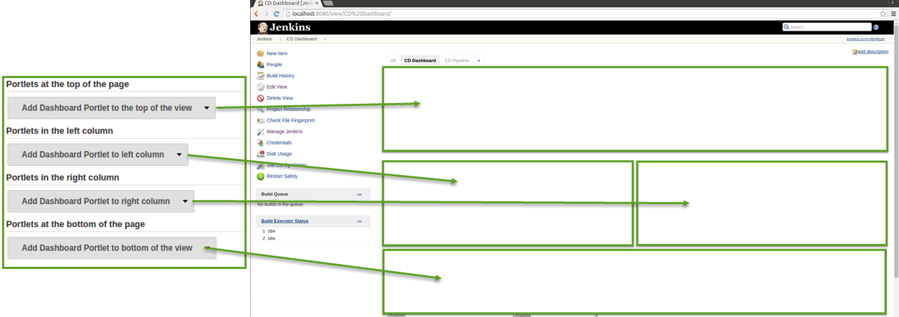
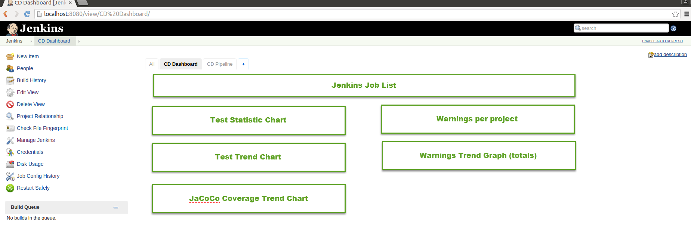
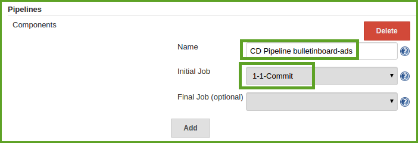
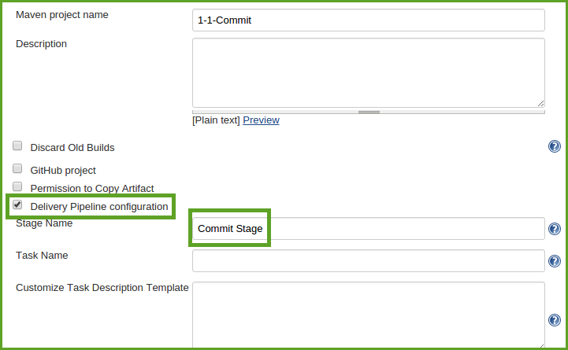
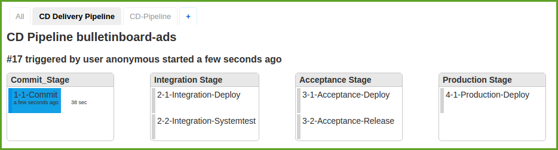

# Exercise: Dashboards and Jenkins Views

##Content

In this exercise, you will have the chance to visualize the quality metrics result as well as pipeline running process in their dedicated views. 

##Step 1: Create Dashboard View 
Dashboard view gives a port-like view for the selected jenkins jobs. 
- on the Jenkins main page, click the + tab to start the new view wizard. 
- on the create new view page, give your view a name and select the `Dashboard` type and click ok.
- in the `Job Filters` select the jobs to be included in the view. **Optional** Also a regular expression can be used to specify the jobs to include in the view. For example, enter `[0-9]-[0-9]-.*` will include all the jobs defined in this Jenkins training. `.*Integration.*` on the other hand only includes the jobs in integration stage. 
- in the `Dashboard Portlets`, select which dashboard portlets to be included in the view. The portlets are distributed in four sections in the dashboard view. 

- now, try to configure your dashboard view to display the following charts or statistics.  

##Step 2: Create Build Pipeline View
Build Pipeline View provides a view of upstream and downstream connected jobs that typically form a build pipeline.
- on the Jenkins main page, click the + tab to start the new view wizard. 
- on the create new view page, give your view a name and select the `Build Pipeline View` type and click ok.
- in the configuration select `1-1-Commit`as the initial job. In `No Of Displayed Builds`, you can choose how many builds you want to be displayed.
- click Ok to end the configuration. Click `Run` in the view and watch how every stage of the pipeline runs and changes its status. 

##Step 3: Create Delivery Pipeline View and Visualize the CD Pipeline 
In Continuous Delivery feedback and visualisation of the delivery process is one of the most important areas. When using Jenkins as a build server it is possible with the Delivery Pipeline Plugin to visualise one or more Delivery Pipelines in the same view even in full screen.
- on the Jenkins main page, click the + tab to start the new view wizard. 
- on the create new view page, give your view a name and select the `Delivery Pipeline View` type and click ok.
- in `Pipelines` settings click `Add` in `Components`. Give the component a name `CD Pipeline bulletinboard-ads` and enter `1-1-Commit` as the initial job.

- save the configurations by clicking `Ok`. 
- Now assign the jobs to different CD stages. Click on a job and click `Configure`. Check `Delivery Pipeline configuration` box and give it a stage name. You should have four stages `Commit Stage`, `Integration Stage`, `Acceptance Stage` and `Production Stage`

- After you add the delivery pipeline configuration to all the jobs, click on the `CD Delivery Pipeline`. Do you have all the jobs and stages in the view? You probably only see the two stages. This is because we manually start the `3-1-Acceptance-Deploy` in our current CD configuration. Now edit the `2-2-Integration-Systemtest` job to trigger `3-1-Acceptance-Deploy` when the build is success. 
- Start the `1-1-Commit` job. You can see now the whole visulized Jenkins CD Pipeline. 

**Optional:** 
- Change some of the view configurations. Click `Edit View`. Check some boxes under `View Settings`. For example `Enable start of new pipeline build`, `Show commit messages`, `Show junit results` and `Show static analysis results`. 
- Click `Ok` and see the differences in the view. 
