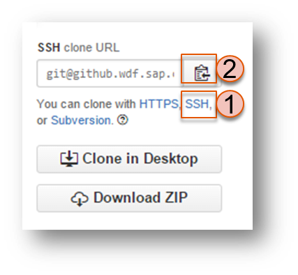

#Exercise: Infrastructure as Code -  Set up a space 

##Content
In this exercise, you are going to utilize Jenkins jobs and Github repository to set up spaces by your definition through a ruby framework. 


## Learning Goal
At the end of the exercise you should be able to have a structure as the following graph: 
- a Jenkins job to synchronize and install the ruby framework/automation gem from a git repository
- a Jenkins job to synchronize and download the environment.yml file from a git repository
- a Jenkins job that set up space by running the ruby script in combination with the environment.yml file


##Step 1: Install `cc-automation` Gem
We are going to create a Jenkins job to download and install a ruby framework `cc-automation` which handles cloud foundry commands.
- Go to your ` CD Pipeline` view in Jenkins. Click `New Item` and create a new `Freestyle project` called `automation-gem-install`.
- In the row `Source Code Management`, choose git and add `git@github.wdf.sap.corp:cc-java-dev/cc-m4-automation-scripts.git` in the url. Choose the `m4user`as credential.
  - **NOTE: ** the ruby framework is developed by our team. It is not the final version yet as there are still some on-going changes and constructions.  
- Add `Execute shell` in `Build` . Copy and paste the following codes in the input field. 
```SHELL
cd scripts
bundle
rake install
```
- **Build the job**. Make sure the build is successful so that the automation gem is installed

##Step 2: Prepare the environment.yml file in a git repository
We are going to create a repository in git where we save the yml files that define our space. In this exercise we will try to set up our acceptance space. 
- Go to `https://github.wdf.sap.corp/` and sign in with your D/C/I user. 
- Click on `+` sign in the top menu and choose `New repository`

- Enter `automation-env` as the repository name, check `Initialize this repository with a README` and click `create repository`

-  Click on `+` besides the repo name to add a new file.

- Enter `bulletinboard-acceptance_environment.yml` as the file name. 
- Adjust the following codes according to your organization and acceptance space name. Then paste them in the edit field

```YAML
---
cf_api_endpoint: https://api.cf.sap.hana.ondemand.com
cf_organization: <your-org-name>
cf_space: <your-acceptance-space-name>
services:
  - instance_name: postgres-bulletinboard-ads
    service: postgresql-9.4-lite
    plan: free
  - instance_name: bulletinboard-mq
    service: rabbitmq-3.5.6-lite
    plan: free
user-roles:
  developer:
    - p1941561961
  manager:
    - p1941561961
```
- Click `Commit new file` at the buttom. 

##Step 3: Create a Jenkins job to load the environment.yml file 
We are going to create a Jenkins job to load the environement.yml file from github repository. 
- Go to your `CD Pipeline` view in Jenkins. Click `New Item` and create a new `Freestyle project` called `automation-env-download`.
- In the row `Source Code Management`, choose git and add the ssh url of your automation-env repo.
 
- Click `Add Post-build Action` and select `Archive the artifacts` in the drop-down list. Enter `*.yml` in the input field.
- Save and Build the job. Make sure the build is successful so the yml files are saved in the Jenkins archive and can be used in the next job. 

##Step 4: Create a Jenkins job to set up space
We are going to create a Jenkins job which uses the archived artifacts we saved in the previous exercises. 
- Click `New Item` and create a new `Freestyle project` called `space-setup`.
- Check the box before `This build is parameterized`, click `Add Parameter` and select `String Parameter`. 
- In `name` input field, enter `ENVIRONMENT_DIR`. In `default` input field enter `/home/vagrant/.jenkins/jobs/automation-env-download/builds/lastStableBuild/archive`
- In the following `Build`session, click `Add build step` and choose `Execute shell`. Adjust and paste the following codes into the `Command` input field. 

```SHELL
export CF_API_ENDPOINT=https://api.cf.sap.hana.ondemand.com
export CF_USERNAME=<CF_USERNAME>
export CF_PASSWORD=<CF_PASSWORD>

space_manager setup-all-environments ${ENVIRONMENT_DIR}
```
- save the job settings.

##Step 5: Run the `setup-space` job and check your space settings
- Open the terminal in the VM and log in as p-user and go to your org. 
- Adjust the following command with your own acceptance space name and run it in the terminal
```
cf delete-space <your-acceptance-space-name>
```
- Run the Jenkins job. 
- After the job is successfully built, use the cf commands in the terminal to check out 
  - whether your space is created?
  ```
  cf target -o <your-org-name> -s <your-acceptance-space-name>
  ```
  - whether your services are created?
  ```
  cf services
  ```
  - whether your role is set?
  ```
  cf space-users <your-org-name> <your-acceptance-space-name>
  ```
##Step 6: Refactor and automate the jobs
Till now we have manually started all the jobs. Now we are going to configure the job so they synchronize with the github and are automatically triggered. 
- automation-gem-install job poll the changes from the git
- automation-env-download job poll the changes from the git
- space-setup job is triggered by a successful build from automation-env-download job. 


##Step 7: Environment Definition for Production Space
Now also configure automatic environment setup for your production space. To do so, just create a new configuration file `bulletinboard-production_environment.yml`.

Pushing this file should trigger the job automatically. It should not change anything in your production space, as you've already created all services etc. previously - but from now on, everything is under version control. This means when somebody changes the space configuration, we will see it in our Github repo.
