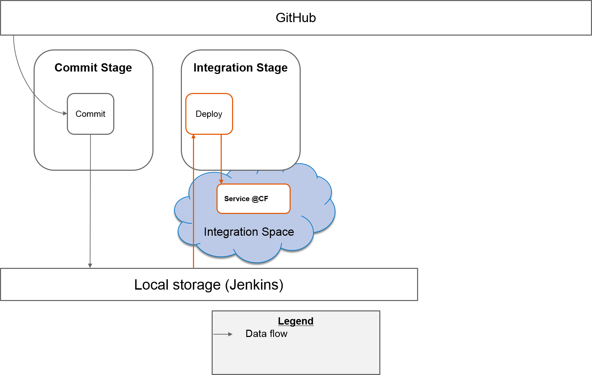
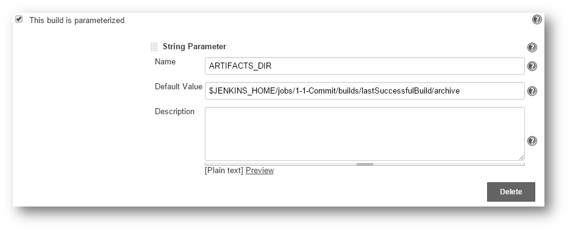
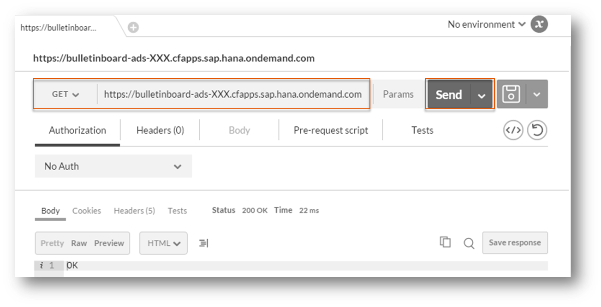
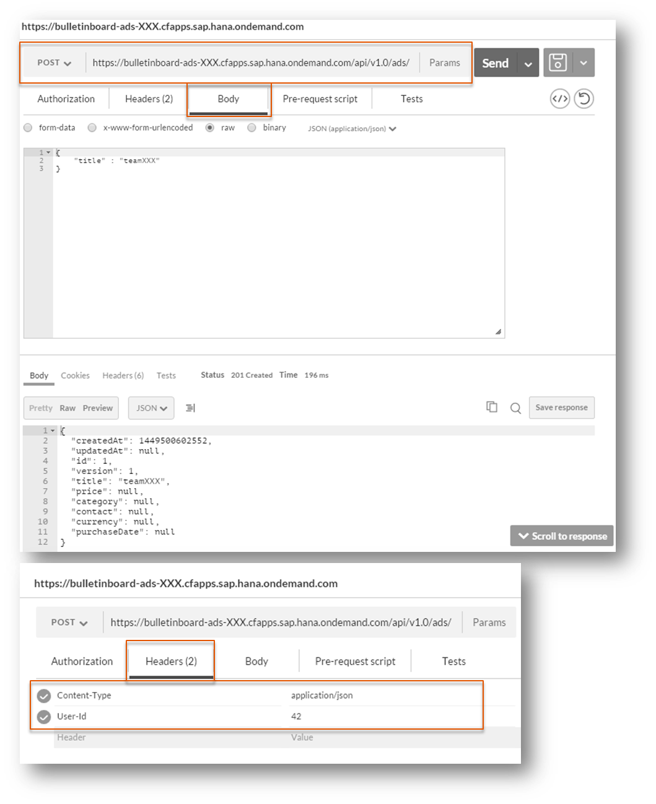
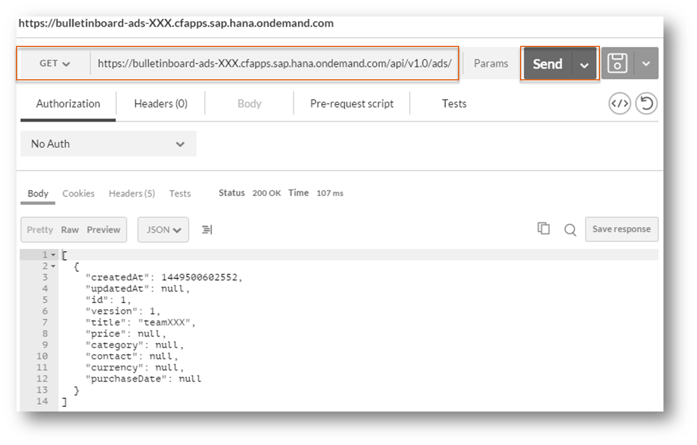

# Exercise: Integration Stage Part 1 - Deploy

##Content
In this exercise you will create the job `2-1-Integration-Deploy`. This job is responsible for the deployment of the built artifact into the integration space. In order to use the archived artifact from the job `1-Commit` and to deploy it, you will add an archive directory parameter which points to the built artifact. With this information you can copy the artifact into the workspace of this job (`2-1-Integration-Deploy`) and upload it to Cloud Foundry. 

Additional, after successfull deployment, you will test manually whether the deployed microservice works.

**Hint**: In a later exercise you will handover the parameter given by the job `1-Commit` to this job.

##Overview




##Step 1: Create Job
- On the upper left side click on `New Item` to create a new job
- Select `Freestyle project` and give the name `2-1-Integration-Deploy`
- Press the button `OK`
- In section `Build` press the button `Add Buildstep`, then select `Execute Shell` and copy/paste the following code (**Hint**: Replace `<place-holder>` accordingly):
```SHELL
cf --version
cf login -u <cf-user-name> -p <cf-user-password> -a https://api.cf.sap.hana.ondemand.com -o <your-org-name> -s <your-integration-space-name>
cf services
cf create-service postgresql-9.4-lite free postgres-bulletinboard-ads
cf create-service rabbitmq-3.5.6-lite free bulletinboard-mq
cf push -n bulletinboard-ads-integration-<your-user-id>
```
- Keep the configuration open and proceed with Step 2

##Step 2: Add an archive directory parameter to the deploy job

* Check the box `This build is parameterized`
* Add a `String Parameter`
* Set name to `ARTIFACTS_DIR`
* Set default value to `$JENKINS_HOME/jobs/1-Commit/builds/lastSuccessfulBuild/archive`.  This uses the artifacts from the last successfull `1-Commit` job



* To copy the stored artifact `bulletinboard-ads.war` and the `manifest.yml` from `${ARTIFACTS_DIR}/target`, copy the following code and insert it at the beginning of the Shell script

```SHELL
mkdir -p target

cp $ARTIFACTS_DIR/target/bulletinboard-ads.war target
cp $ARTIFACTS_DIR/manifest.yml .
```


- Save the job


##Step 3: Console Log
- Run the job `2-1-Integration-Deploy`
- Inspect/analyse console log


##Step 4: Call the service with postman
If you have installed Google Chrome, Postman and CF client, you can work from your local pc/laptop. Otherwise start the virtual machine and work there

###Step 4.1: Get the URL to your app
- Open the console/terminal
- Execute the following commands (**Hint**: Replace `<place-holder>` accordingly):

```SHELL
cf login -u <cf-user-name> -p <cf-user-password> -a https://api.cf.sap.hana.ondemand.com -o <your-org-name> -s <your-integration-space-name>
cf apps
```
- Copy the URL (route) to your app

###Step 4.2: Call your microservice
- Start Google Chrome / Chromium
- Open Postman
- Select `GET` and paste the URL to your app (**Hint**: You must use the HTTPS protocol)
- Send the request. As response `OK` should be returned




###Step 4.3: Get all advertisements
- Open Postman
- Select `GET` and paste the URL to your app (**Hint**: You must use the HTTPS protocol)
- Extend the URL with `/api/v1.0/ads/`
- Send the request. As response an empty array should be returned. **Remark**: We do not have created any advertisements so far - so there are no ones

###Step 4.4: Create a new advertisement
- Open Postman
- Select `POST` and paste the URL to your app (**Hint**: You must use the HTTPS protocol)
- Extend the URL with `/api/v1.0/ads/`
- Select the tab `Body`
  - Select the radio button `raw`
  - Instead of `Text` select `JSON (application/json)` from the drop down list
  - In the text field enter: (Replace `<place-holder>` accordingly)
```
{
    "title" : "new-advertisement-from-<your-user-id>"
}
```
- Select the tab `Headers`
  - Insert `User-Id` as `Header` and `42` as `Value` as new entry
- Send the request
- As response you get the currently created advertisement




###Step 4.5: Get all advertisements
- Open Postman
- Select `GET` and paste the URL to your app (**Hint**: You must use the HTTPS protocol)
- Extend the URL with `/api/v1.0/ads/`
- Send the request. As response all existing advertisements should be returned


