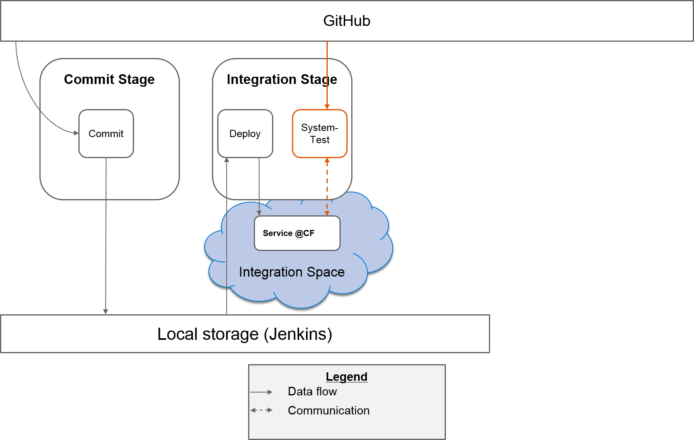
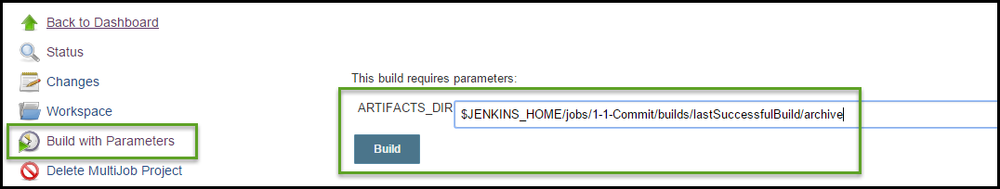

# Exercise: Integration Stage Part 2 - System Test

##Content
In this exercise you will create the job `2-2-Integration-Systemtest`. This job is responsible to perform the system tests against the deployed microservice within the integration space. To perform the tests, the job synchronizes the associated GitHub repository. Then the tests will executed.

**Hint**: We do not need to copy the stored artifacts to the workspace of this job, because this job doesn't make use of them. We only want to pass the path to the stored artifacts to the next job later on. Therefore we need to add a parameter.

##Overview



##Step 1: Create System Test Job
- Navigate to the root/main page of your Jenkins Server
- Create a new `Maven Project` (maven job) and name it `2-2-Integration-Systemtest`
- In section `Source Code Management` select the radio button `Git` and define the following `Repository URL`: `git@github.wdf.sap.corp:cc-java/cc-bulletinboard-systemtest.git`. Also select `Credentials` `github`
- In section `Build` define `pom.xml` as `Root POM` and paste the following code into the text field `Goals and options` (Replace `<place-holder>` with your own information):
```SHELL
clean verify  -DUSER_ROUTE=https://bulletinboard-users-cd.cfapps.sap.hana.ondemand.com/ -DAD_ROUTE=https://bulletinboard-ads-integration-<your-id>.cfapps.sap.hana.ondemand.com
```


##Step 2: Add an artifacts directory parameter
* Check the box `This build is parameterized`
* Add a `String Parameter`
* Set name to `ARTIFACTS_DIR`
- Save the job


##Step 3: Console Log
- Run job `2-2-Integration-Systemtest` , click `Build with Paramters` in the left column
  - As `Parameter` define `$JENKINS_HOME/jobs/1-Commit/builds/lastSuccessfulBuild/archive`
  
- Inspect/analyse console log
