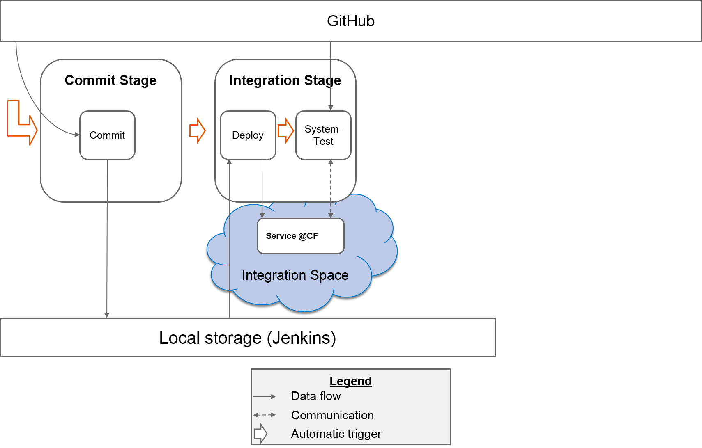
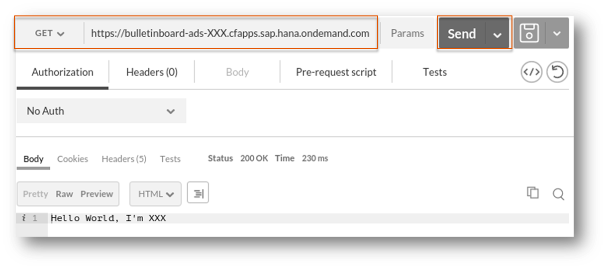

# Exercise: Job Orchestration

##Content
In this exercise you will orchestrate the jobs which you have built so far:

- In order to trigger the job `1-1-Commit` automatically after a change in the associated GitHub repository, you will add a polling mechanism to this job
- To trigger the further jobs you will add a `Post-build Action` to the particular jobs

After the implementation of the automatic trigger meachanisms you will perform a change in the GitHub repository to see whether your implementation works.

##Overview

 
##Step 1: Trigger Job `1-Commit`  automatically
We want to poll every minute and check if there are changes in the GitHub project
* Configure your job `1-Commit`
* In section `Build Triggers` check `Build when a change is pushed to GitHub`
* Save the job
* Configure the webhook on Github for your repository as described [here](Optional-Exercise-Github_Webhook.md) 

##Step 2: Trigger Job `2-1-Integration-Deploy` automatically
After a successfull build (commit job), we want to trigger the job `2-1-Integration-Deploy`
* Configure your job `1-Commit`
* In section `Post-build Action` add the post-build action `Trigger parameterized build on other projects`:
  * Projects to build `2-1-Integration-Deploy`
  * Select `Add Parameters` -> `Predefined parameters`
  * **Note:** we have been using the `lastSuccessfulBuild` from the commit stage as the default parameter where we get the achived artifacts. Is it a good idea? What if multiple jobs are running parallly? Whatever archived in the `lastSuccessfulBuild` will be overwritten. Suppose someone is testing a version, decides that the version works and releases it. In the meantime, a new version comes through the commit stage and overwrites the archived files. The tester will be releasing something he hasn't tested at all. Instead of using `lastSuccessfulBuild` we should pass the artifacts from a specific build. 
  * Therefore, add parameter `ARTIFACTS_DIR=${JENKINS_HOME}/jobs/${JOB_NAME}/builds/${BUILD_NUMBER}/archive` to the `Predefined parameters`. **Hint**:This overwrites the default value given in `Exercise 4 Part 1: Integration Stage - Deploy`. Here the current job of `1-Commit` is represented with unique number `${BUILD_NUMBER}`.
* Save the job

##Step 3: Trigger Job `2-2-Integration-Systemtest` automatically
After successfull deploy, we want to trigger the job `2-2-Integration-Systemtest`
- Configure your job `2-1-Integration-Deploy`
* In section `Post-build Action` add the post-build action `Trigger parameterized build on other projects`
  * Projects to build `2-2-Integration-Systemtest`
  * Select `Add Parameters` -> `Predefined parameters`
  * Add parameter `ARTIFACTS_DIR=${ARTIFACTS_DIR}` to the `Predefined parameters`
* Save the job
- Configure your job `2-2-Integration-Systemtest` empty the defaul value for the parameter`ARTIFACTS_DIR`

##Step 4: Change coding in GitHub
- Navigate to your forked GitHub project and open the file  `/src/main/java/com/sap/bulletinboard/ads/resources/DefaultResource.java`
- Press the "pen-button" to edit the file
- Change the return value of the method `public String get()` to `"Hello World, I'm <your-id>"` (Replace `<place-holder>` with your information accordingly)
- Press the button `Commit Changes` - this saves your changes
- Switch to your Jenkins
- After max one minute the job `1-Commit` should run
- Wait until job `2-2-Integration-Systemtest` was executed successfully: Then continue with step 5

##Step 5: Call your microservice
- Start Google Chrome / Chromium
- Open Postman
- Select `GET` and paste the URL to your app (**Hint**: You must use the HTTPS protocol)
- Send the request. As response `Hello World, I'm <your-id>` should be returned

