# Exercise: Kibana Part 1 - Dashboards

## Content
Kibana is an open source data visualization plugin for Elasticsearch. It provides visualization capabilities on top of the content indexed on an Elasticsearch cluster. Users can create bar, line and scatter plots, or pie charts and maps on top of large volumes of data.

## Logging in and Authorization
- Go to Kibana: https://logs.cf.sap.hana.ondemand.com
- Login with your own user. You might not see any information in the Kibana page - at least you will not be able to see the logs from your application. This is because your user is not assigned to the cloud foundry landscape yet. 
- Assign the `auditor` role to your user in the production space by altering the `bulletinboard-production_environment.yml` file (see [Exercise: Infrastructure as Code](Optional-Exercise-InfrastructureAsCode-SpaceServiceRoles.md))
  then you should be able to view a bunch of logs your application has created
- As you have automated this already, pushing this change will setup the production space automatically
- You can find more information about users and roles [here](UsersAndRoles.md)  

## Step 1: Discover in Kibana
- The logs generated by our application are already saved in Kibana. You can interactively explore your data from the Discover page. You have access to every document in every index that matches the selected index pattern. 
- Read more [here](https://www.elastic.co/guide/en/kibana/current/discover.html) <sup>[1](#footnote)</sup>
- Go and have a look by starting with a clicking `Discover` tab.
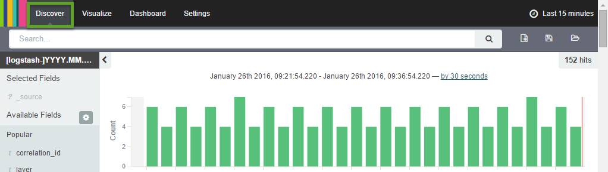

### Step 1.1 : Analyze your Log Message - Filter Columns
- In the search field enter `"bulletinboard-ads"`
- Expand the log messages by clicking on the arrow on the left side of the log. In the Table view scroll down, find the following parameters and click on the symbol you can see in the screenshot below:
  * `level`
  * `source_instance`
  * `component_id`
  * `correlation_id`
  * `logger`
  * `raw.cf_app_name`
**Note: ** Not all the logs have the parameters, so think about what would be the best parameter to find all the logs of one particular application. 
 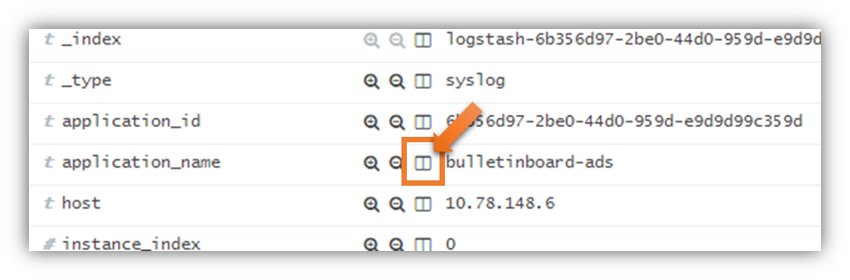

- Collapse the log list entry you have expanded. Now you can see, that only the parameters you have selected are displayed as columns
- Remove the column `cf_app_name` from the overview list. Then expand the list entry, find the parameter `cf_app_name` and click again on the symbol shown in the screenshot above. When collapsing log entry, the column should be removed from the overview list. Alternative approach: mouse over the headline of a column to be removed and click on the "x" (mouse-over-text: Remove column).

### Step 1.2 : Analyze your Log Message - Message Filters
In Kibana you can define positive and negative filters for messages.

If a positive filter is used, only messages matching the filter are shown. For example, you can define a positive filter so that only log messages for a specific Java class are shown.

- Choose a log entry where the value of the parameter `logger` is `com.sap.bulletinboard.ads.resources.AdvertisementResource`. Scroll down to the parameter `logger` and click on the positive filter symbol.  Now only log entries for the specified logger/class are shown and you should see this filter with a green background directly under the search field.
- To remove a set filter, mouse over to the filter which is displayed directly under the search field and click on the garbage can symbol. Perform this for the filter you just have set (`logger:"com.sap.bulletinboard.ads.resources.AdvertisementResource"`).

Messages matching a negative filters are not shown. This can be used to remove certain messages from the output, for example you can define a negative filter removing with log level `INFO` (so that you can better concentrate on warnings and errors).

- Choose a log entry where the value of the parameter `level` is `INFO`. Scroll down to the parameter `level` and click on the positive filter symbol.  Now all log entries with log level `INFO` should be filtered out and you should see this filter with a red background directly under the search field.
- To remove a set filter, mouse over to the filter which is displayed directly under the search field and click on the garbage can symbol. Perform this for the filter you just have set (`level: "info"`).

## Step 2: Visualize in `Kibana` 
- Near the `Discover` tab you can find the `Visualize` tab which enables you to display aspects of your data sets in several different ways.Now we are going to create a `line chart` to show the max response time of our application.
- Read more [here](https://www.elastic.co/guide/en/kibana/current/visualize.html) <sup>[1](#footnote)</sup>

### Step 2.1: Create a line chart for `Maximum response time`
#### Step 2.1.1: Select `line chart`
- Click on the tab `Visualize` and select `Line chart` in `Step 1`
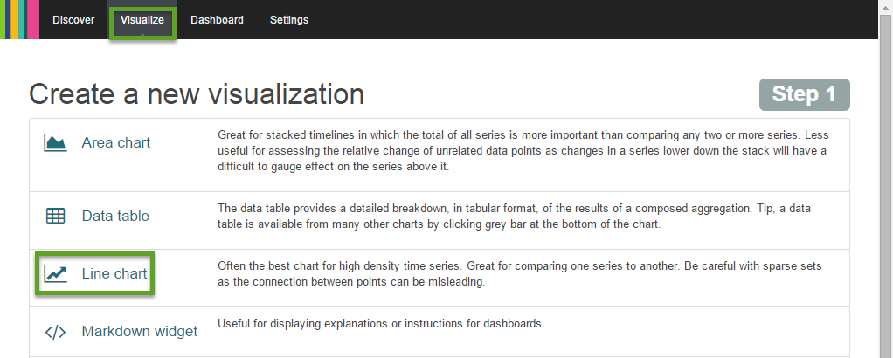

- Select `From a new search` in the following page. 

#### Step 2.1.2: Set up metrics 
- Click  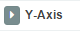
- Select `Max` as aggregation for the `Y-Axis`
- Choose `response_time_ms` in the dropdown menu of `Field`

#### Step 2.1.3: Set up buckets
- Click `X-Axis` in `Select Buckets Type`. Choose `Date Histogram` as `Aggregation` in the dropdown menu. Make sure `@timestamp`is chosen in the `Field` and `Auto` is selected as `Interval`.
- Click on the green triangle at the upper right corner of the left column and you will see the chart visulized. 
- The following graph summarizes the settings for this line chart.

 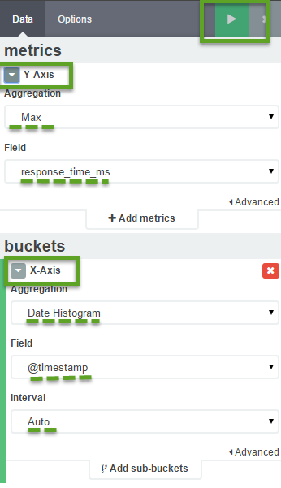
 
- *NOTE:* Enlarge the time range for the graph if your chart is empty. 
 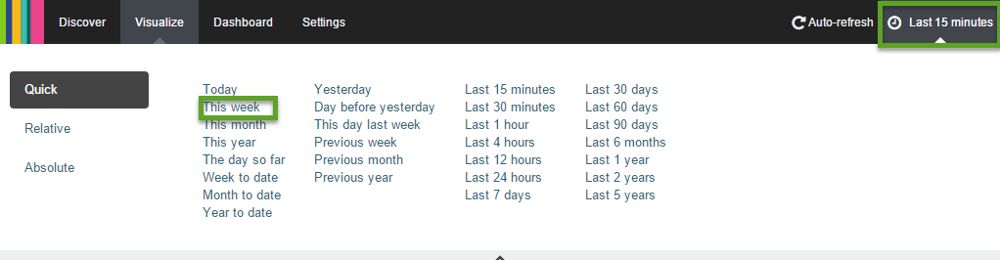

#### Step 2.1.4: Save the visualization
- click on the `save` button on the upper right corner of the visualization. 
- Give the visualization a name : `Maximum response time DevOps-<your-id>`

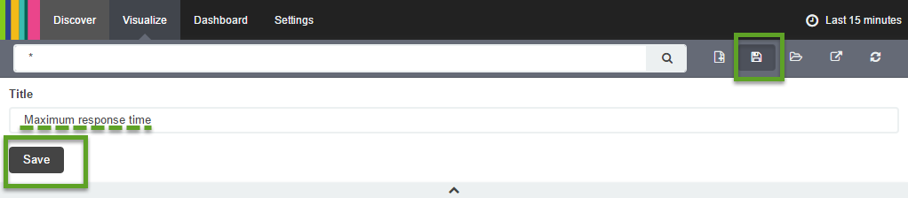

## Step 2.2: Create line chart to show `Request count over time`
- The process is basically the same as creating the `Maximum response time` chart. Only this time you have to change metrics in `Y-Axis`. Think about which item can best reflect the total number of requests.
- *Hint:* Every request has a **unique correlation id**
- Save the chart under name `Request count over time DevOps-<your-id>`
**Note: ** Your Y-Axis setting should be look like this:

 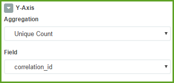


##Step 2.3: Use `filter` to visualize `Errors over time`
Another important information we would like to show in Kibana is the errors our app bump into. This requires a filter to visualize it.
- Click on the tab `Visualize` and select `Line chart` in `Step 1`
- Select `From a new search` from the following page. 
- Choose `Count` in the dropdown menu of `Aggregation`.
- Click `X-Axis` in `Select Buckets Type`. Choose `Date Histogram` as `Aggregation` in the dropdown menu. Make sure `@timestamp`is chosen in the `Field` and `Auto` is selected as `Interval`.
- Click `Add sub-buckets` and choose `Split line` or `Split chart`. Select `Filter` as `Sub aggregation` and enter `level:ERROR` in `Filter 1`.
- Save the chart under name `Errors over time DevOps-<your-id>`.

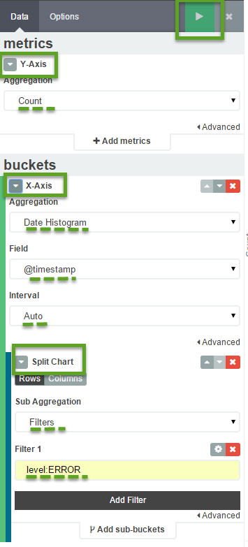

##Step 3: Dashboard in `Kibana` 
- A Kibana dashboard displays a set of saved visualizations in groups that you can arrange freely. You can save a dashboard to share or reload at a later time.
- Read more [here](https://www.elastic.co/guide/en/kibana/current/discover.html) <sup>[1](#footnote)</sup>

###Step 3.1: Create Dashboard
- Click "Dashboard"
- Click the "New Dashboard" button
  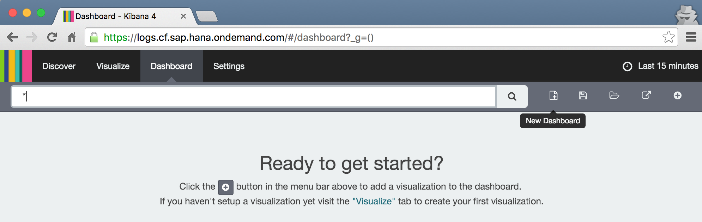

###Step 3.2: Add Visualizations

Next, we want to add the visualizations we created previously to our dashboard 
- Click the "Add Visualization" button to add the following  (use the filter field for quick search):
  - `Errors over time DevOps-<your-id>`
  - `Maximum response time DevOps-<your-id>`
  - `Request count over time DevOps-<your-id>`
  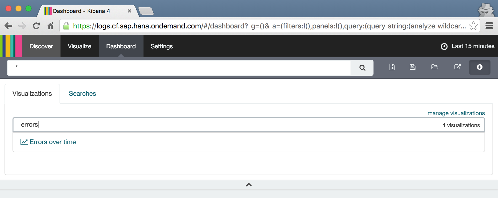

- Switch to the "Searches" tab and add the LogMessages search (use the filter field for quick search):
  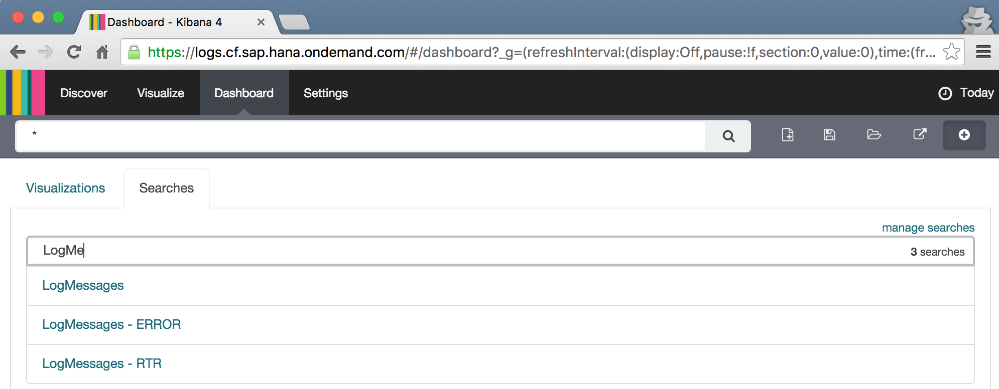

- Arrange the components so that the 3 visualizations are in the first row and the log messages in the second row
  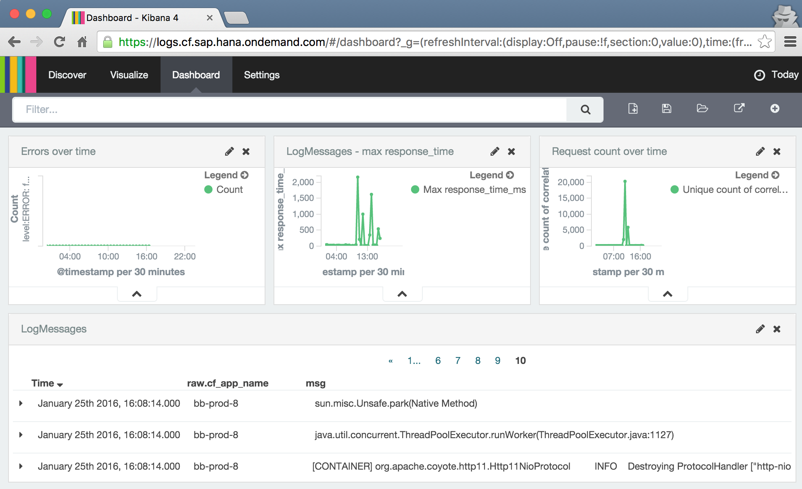

### Step 3.3: Application Filter

We want our dashboard to only display data from our application in the production space. The app name is not a good filter, because it is only unique within one space, so we will use the application id. Furthermore, as we use a blue-green deployment, we have 2 apps in production, ...-blue and ...-green, so we need 2 application IDs  

- Open a command line and target the CF CLI to your production space
  
  ```
  cf target -o <your-org> -s <your-production-space>
  cf env bulletinboard-ads-<blue-or-green>
  ```
  
  ```cf env``` will show the application id in the VCAP_APPLICATION environment variable:
  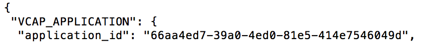

- In your Kibana Dashboard enter the following expression in the "Filter..." field:
  
  ```
  "<application_id_blue>" OR "<application_id_green>"
  ```
  
  The quotes (") are important because your application IDs likely contains hyphens (-), which otherwise would have a search semantic, and "OR" really needs to be capitalized - "or" doesn't have a search semantic!
  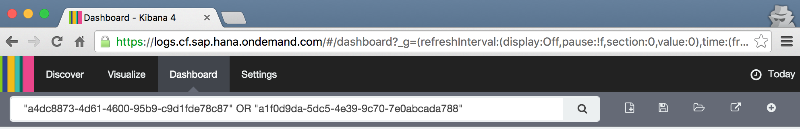


### Step 3.4: Time Filter

By default, we want to see the data from today in our dashboard
- Filter for "Today" by clicking on the clock button in the upper right and using the "Quick" filter
  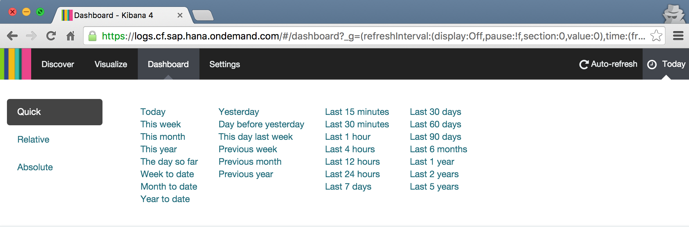

### Step 3.5: Save the Dashboard

Save the dashboard so that it appears in the list:
- Click on "Save Dashboard"
- Activate check box "Store time with dashboard"
- As name enter `My Dashboard DevOps-<your-id>` 
- Click "Save"
  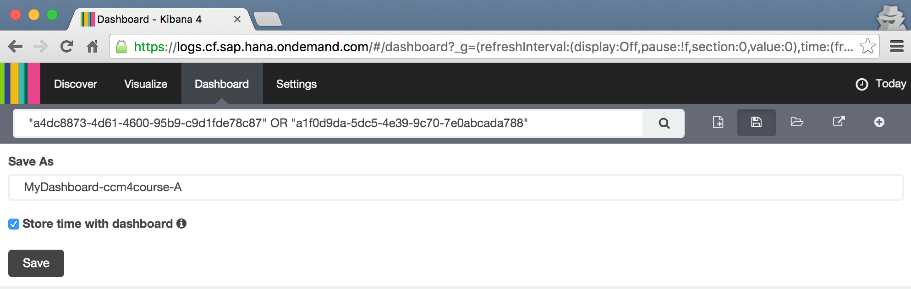

## Footnotes

<a name="footnote">[1]</a>: *the document points to the most current version of Kibana. Some features might not be supported yet owing to a different version in our landscape.*
