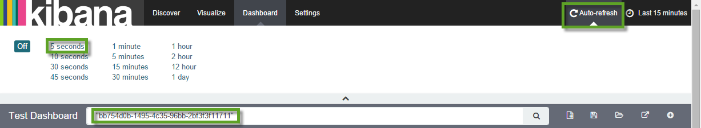
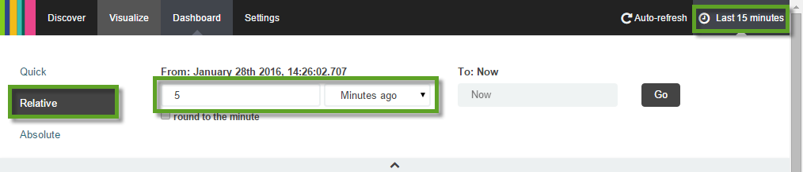
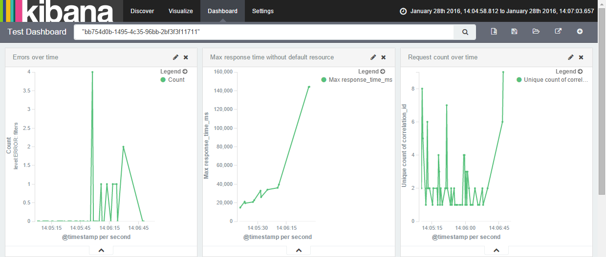

# Exercise: Kibana Part 2 - Application Monitoring

## Content
You are going to use the Kibana Dashboard you have just created to monitor an application, and analyze an issue. 

## Step 1: Assign Yourself SpaceAuditor for Application
You are going to analyze an issue using Kibana in space `production_XXX`, and therefore your should have the SpaceAuditor role in that space:
- Open a terminal and execute the following commands

  ```
cf login -user <p-user> -password <password>
cf set-space-role <d/c/i-number> ccm4course productionXXX SpaceAuditor
```

## Step 2: Monitor Application
- Open your dashboard in Kibana
- Change the filter from your application IDs to the application IDs of bulletinboard-ads *in space productionXXX* (like you did in previous exercise)
  - *Note: Don't forget the quotation marks*
- Set the dashboard to auto refresh itsself. 

- Limit the time range to last 5 minutes


## Step 3: Analyze an Issue
We will simulate an issue and you should be able to observe some changes on your dashboard.

- Are there any irregularities, e.g. errors, peaks etc.?
- Use the dashboard to analyze the issue:
  - What are the log messages which are related to the irregularities?
  - Is there a relation between errors and response time?
  - What other factors have an influence on the occurrence of errors?
  - What could have caused the error?
- *Hints:* 
  - narrow the time range by dragging with the cross sign
  - use field correlation-id to find all log entries that are related to one round trip

## Correlation ID
Correlation ID is a concept which is very important in the context of distributed communication like in a Microservice architecture. It is illustrated very well in the following article:

http://theburningmonk.com/2015/05/a-consistent-approach-to-track-correlation-ids-through-microservices/
