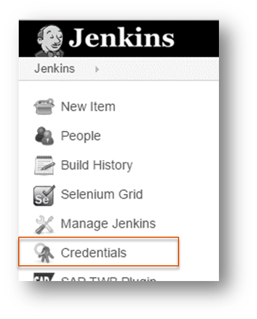

#Exercise: Preparation and Initial Steps

##Content
In this exercise you will perform some general steps and settings. You will:
- fork our project
- set some global system settings in your Jenkins server
- establish SSH connection between Jenkins and GitHub
- create a hello world job
- create a view

##Step 1: Fork GitHub Project
- Fork the project [`cc-bulletinboard-ads-cd`](https://github.wdf.sap.corp/cc-java/cc-bulletinboard-ads-cd). 
- **Hint**: We will use this project to build, test and deploy it via our pipeline

##Step 2: Jenkins System Settings
- Start your Jenkins server. **Hint**: In terminal enter
```SHELL
cd ~/apps/jenkins
java -jar jenkins.war --httpPort=9090
```
- This will start your Jenkins server on http://localhost:9090
  - **Hint:** if you want to stop your Jenkins server, just hit `Ctrl + C` in the console where Jenkins is running
- Open the browser and navigate to the above mentioned URL, on the first startup it will take some time until Jenkins is fully up and running
- Navigate to `Manage Jenkins -> Configure System`
- In section `JDK` 
  - Press the button `Add JDK` 
  - Ensure that the box `Install automatically` is **not** checked
  - Define `JDK` as `Name`
  - Define `/home/vagrant/apps/java` as `JAVA_HOME`
- In section `Maven` 
  - Press the button `Add Maven` 
  - Ensure that the box `Install automatically` is **not** checked
  - Define `maven` as `Name`
  - Define `/usr/share/maven` as `MAVEN_HOME`
- Save your configuration

##Step 3: Establish SSH connection between Jenkins and GitHub
We need to add a private key to Jenkins in order to establish a sercure connection to GitHub. Because of some security reasons we do not use the private key from your local pc/laptop - instead you will use the private key from your virtual machine.

- Navigate to the start page of your Jenkins Server
- Navigate to `Credentials`
 


- Click on `Global credentials (unrestricted)`
- On the left side click on `Add Credentials`
- As `Kind` select `SSH Username with private key`
- Enter `github` as `Username`
- Select the radio button `From the Jenkins master ~/.ssh`
- Press `OK`

