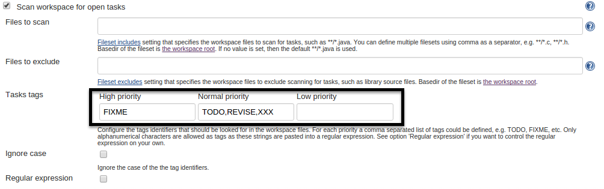
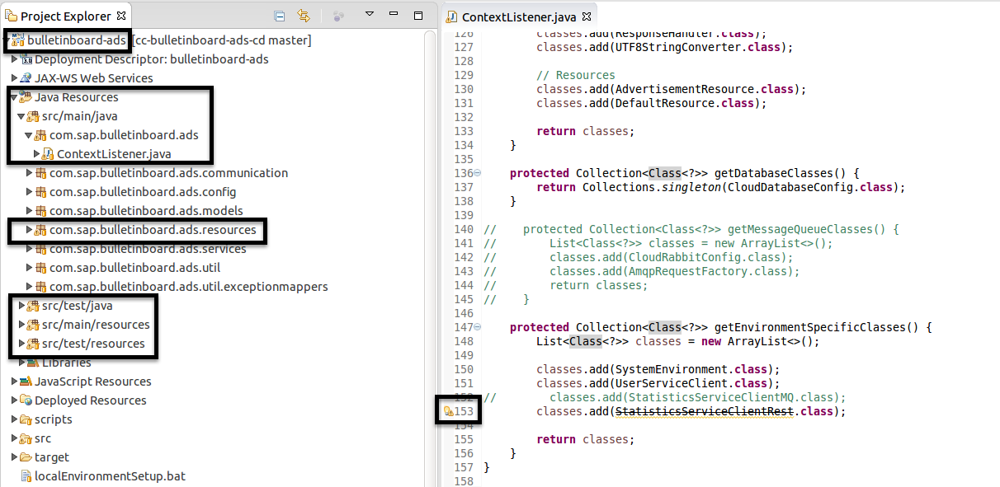

# Exercise: Extend Commit Stage with Quality Metrics

##Content
Jenkins provides some very handy plugins to measure and track your software quality. In this exercise, you are going to learn to use FindBugs, PMD, JaCoCo and some other tools provided by Jenkins to review your codes from different perspectives. 

##Overview

## Step 1: FindBugs
FindBugs is a static analysis to look for bugs in Java code.
More Information: http://findbugs.sourceforge.net/

- go to the `1-1-Commit` job in your CD pipeline and click on the `Configure`. Find the section `Build Settings` and check the boxes: `Publish FindBugs analysis results`
- click `build now`, check whether any analysis result is displayed in Jenkins.
- As you can see the FindBugs plugin is only responisble for publishing the analysis result, the job of analyzing the codes is not carried out yet. You should add the FindBugs analysis in maven. Now, maintain your pom.xml to enable the FindBugs maven plugin. Add the following codes in your pom.xml inside the `<plugins>` element of `<build>` section. You can edit directly in your forked repo by clicking the 'pencil' sign at the upper right side. 
```XML
            <plugin>
                <groupId>org.codehaus.mojo</groupId>
                <artifactId>findbugs-maven-plugin</artifactId>
                <version>3.0.2</version>
                <executions>
                    <execution>
                        <phase>verify</phase>
                        <goals>
                            <goal>findbugs</goal>
                        </goals>
                    </execution>
                </executions>
            </plugin>
```
- build the job again. After the successful build, you should see the FindBugs entry on the left side panel as well as inside the page of your last build. Click on the `FindBugs Warnings` and inspect on the warnings. Notice how they are categorized and prioritized. 
- now let's define our build status according to the result of FindBugs. Open the configure page of the job and find the `Publish FindBugs analysis results`. Click `Advanced...` and search for `Status thresholds (Totals)`. Now set the threshold to change the build status into unstable or failed. For example, enter `3` in `Priority normal`.
 

- build the job again, see whether the status of your new build is changed according to your threshold setting. Now you can also see a FindBugs trend chart in the main page of your job. 
- Optionally, you can try to change the build status from maven. Check the `Alternative Information` at the end of this page.

## Step 2: PMD
PMD is a source code analyzer. It finds common programming flaws like unused variables, empty catch blocks, unnecessary object creation, and so forth.
More Information: https://pmd.github.io/

- open the configure page of the job. Set back the threshold changes you did in the last step, so we have a perfect little green bubble again. Search for and check the field `Publish PMD analysis results`. 
- start editing the pom.xml in your repository and add the following codes. 
```XML
            <plugin>
                <groupId>org.apache.maven.plugins</groupId>
                <artifactId>maven-pmd-plugin</artifactId>
                <version>3.5</version>
                <executions>
                    <execution>
                        <phase>verify</phase>
                        <goals>
                            <goal>pmd</goal>
                            <goal>cpd</goal>
                        </goals>
                    </execution>
                </executions>
            </plugin>
```
- build your job. After the build, have a look at the analysis results. You can also try to change the build status by defining the `Status thresholds (Totals)`. Refer to the description in Step 1. 

## Step 3: JaCoCo (Java Code Coverage)
JaCoCo is a free code coverage library for Java.
More Information: http://eclemma.org/jacoco

- configure the job. Click on `add post-build action` and choose `Record JaCoCo coverage report`.
- you should also maintain your pom.xml here. Add the following codes to the `<plugins>`. 
```XML
	    <plugin>
                <groupId>org.jacoco</groupId>
                <artifactId>jacoco-maven-plugin</artifactId>
                <version>0.7.4.201502262128</version>
                <executions>
                    <execution>
                        <id>default-prepare-agent</id>
                        <goals>
                            <goal>prepare-agent</goal>
                        </goals>
                    </execution>
                    <execution>
                        <id>default-report</id>
                        <phase>prepare-package</phase>
                        <goals>
                            <goal>report</goal>
                        </goals>
                    </execution>
                    <execution>
                        <id>default-check</id>
                        <goals>
                            <goal>check</goal>
                        </goals>
                        <configuration>
                            <rules>
                            </rules>
                        </configuration>
                    </execution>
                </executions>
            </plugin>
```
- build the job and see whether you can get a rational code coverage result here.  
- the coverage report is definitely wrong here. This is because this version of JaCoCo has some bugs. We will have to downgrade it. 
- go to the home of Jenkins and click `Manage Jenkins` and select `Manage Plugins`. Click on `Installed` and find `JaCoCo plugin`. Click on `uninstall`. 
- go to the following site http://updates.jenkins-ci.org/download/plugins/jacoco/ and download version 1.0.19.
- go to the home of Jenkins and click `Manage Jenkins` and select `Manage Plugins`. Click on `Advanced` and in click the `choose file` button in `Upload Plugin`. 
- choose the plugin you have just downloaded and click `upload`. Check the box `Restart Jenkins when installation is complete and no jobs are running ` . 
- now build the job again and see how the trend chart of JaCoCo changes. 

## Step 4: Task Scanner
Task scanner is a Jenkins plugin for static analysis which scans the workspace files for open tasks and generates a trend report.

- configure the job. In `Build Settings` check the box `Scan workspace for open tasks`. 
- search for `Tasks tags`, insert `FIXME` in the field `High priority` and `TODO,REVISE,XXX` in `Normal priority`. 
 
- build the job and check the generated report. 

## Step 5: Warnings
Warnings is a Jenkins plugin for static Analysis. It scans for warnings in console log or log files
- configure the job. Click on `add post-build action` and choose `Scan for compiler warnings`.
- click `Add` in `Scan console log` and choose `Maven` in the dropdown list from `Parser`.
- save the settings and build the job. Inspect the analysis results by clicking into the build you just processed. Are all the warnings in? This is easy to find out. Open your eclipse and go to the project. If you haven't import the project yet now would be a good time to do it. You can find the detailed description at the end of this page. 
- inspect the project in eclipse. There are warnings in multiple places because of a deprecated class. 
 
- this information is missing in our Jenkins warnings report becaue the compiler is not configured to print the warnings on the console and our warnings plugin only parses the console for keywords like `WARNING` etc.
- to enable the display of the warnings you should add the following elements in pom.xml inside the ` <configuration>` element of `<maven-compiler-plugin>`. 
```XML
        <compilerArgument>-Xlint:all</compilerArgument>
        <showWarnings>true</showWarnings>
        <showDeprecation>true</showDeprecation>
```
 

- build your job again and see the difference in maven warnings report. 

## Additional Information

#### Who checks if quality metrics are met: Maven or Jenkins?
In this exercise, Maven provides most quality metrics like the Findbugs report, and we use Jenkins to decide when a build should be unstable or fail if these metrics are not met.

Alternatively, you can also let Maven decide this: For example, you can set the `<goal>` element in findbugs as `check`. This has an effect to fail the build if the metrics are not met - based on the configuration, e.g. if a bug is found. The actual threshold configuration depends on the plugin, e.g. here you can find some information for JaCoCoverage: http://eclemma.org/jacoco/trunk/doc/check-mojo.html

Unlike Jenkins, Maven does not know the concept of an "unstable" build, so the downside of this approach is that we cannot distinguish between 'unstable' and 'failure'.
E.g. we want the build to be 'unstable' in case Findbugs finds a major iissue and if coverage metrics not met, and 'failure' only for compilation errors, or errors in the infrastructure, like `git checkout` didn't work.
If we use the Maven check mechanism, then all of this will let the Maven build fail and yield the overall status `failure` for the Jenkins job.

#### Importing the Project in Eclipse
- first go to your forked repository and copy the `ssh` route.

   
- open eclipse from the launcher. 
- Select `File - Import - Git - Projects from Git`. **Note:** in the VM the menu bar only appears when you move the mouse cursor to the top of the window, in this case showing "Java EE - Eclipse". 
- In the next dialog, select `Clone URI`. In the following dialog, enter the URI `git@github.wdf.sap.corp:cc-java/cc-bulletinboard-ads.git`.
- After clicking `Next` again, select at least the `master` branch.
Use the `Next` and `Finish` buttons to go through the following dialogs (the default settings should be OK).

