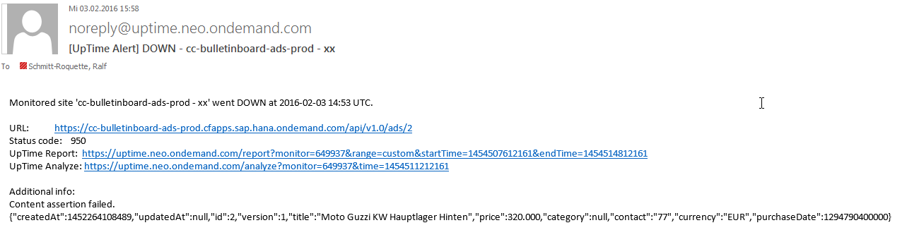

# Exercise: Uptime Monitor

## Content

 In this exercise you learn how to setup a simple availability check for your microservice with 
 [UpTime](https://uptime.neo.ondemand.com/).
 
 - UpTime monitors your SAP HANA Cloud Platform application the same way as your users access it.
 - In Uptime you can configure monitors that probe your application and record status and response time. 
 - UpTime calculates statistics, shows graphical reports and lets you analyze issues down to single response data.
 - When your application has a problem, UpTime notifies you via alert e-mails and it sends weekly reports.

 
## Step 1: Create an availability check with `Uptime`
- Login to Uptime service: https://uptime.neo.ondemand.com/doc

- Make shure your microservice is up and running (e.g. via CLI or Cloud Cockpit)
- Create a new Monitor by button `New Monitor`
- Give an approriate `name`, `description` and enter the application route of your microservice into the field `URL`.
- Set `Proxy` to OFF and `Intervall[min]` to 1 min and save your uptime monitor.

- Now you should see your newly created uptime monitor on the start screen of Uptime.

### Step 2: Discover the graphical reports, statistics your uptime monitor
- To see the reports click the icon `Show Report`

 

- As you have created recently your uptime monitor and set the `Intervall` to 1 min it takes in minimum 1 min to report `Uptime` or `Downtime`. Until then it will report `Unmonitored`.
- After a while the reported state should switch to `Uptime`.
- Additonal you can see the Response Time.

- To see wether your uptime monitor works properly stop your microservice now, e.g. via CLI or Cloud Cockpit.
- The reported state should switch from `Uptime` to `Downtime` latest after 1 min.
- Additional you should get an Alert email, as alerting is activated per default.

 
### Step 3: Create a second availability check with Uptime, incl. now an assertion to check wether an essential functionality of your microservice works.
- This time enter the "get all ads" URL of your microservice into the field `URL`,
e.g https://cc-bulletinboard-d-user.cfapps.sap.hana.ondemand.com/api/v1.0/ads
- To enhance your uptime monitor by an assertion, go to the 'Assertion tab'.
- There choose 'CONTAINS' in field `Assertion Type` and '@' in field `Assertion Value` to check wether in the response email adress is available.
 

