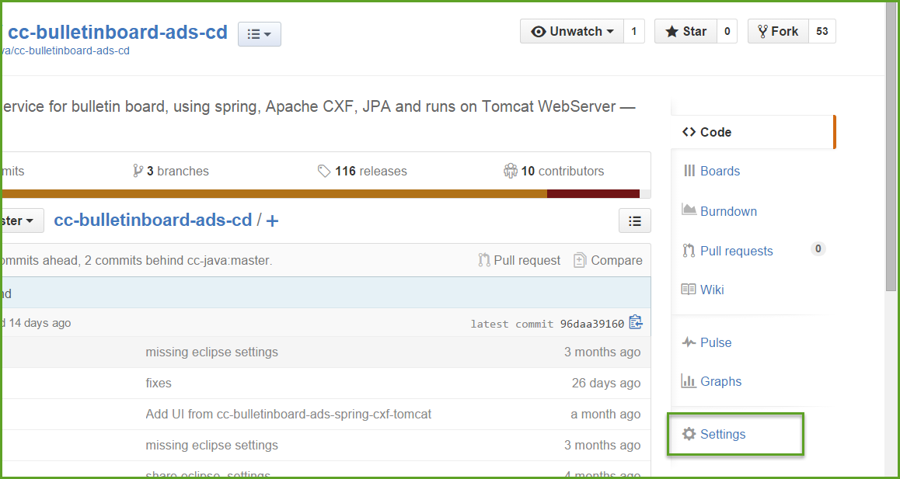
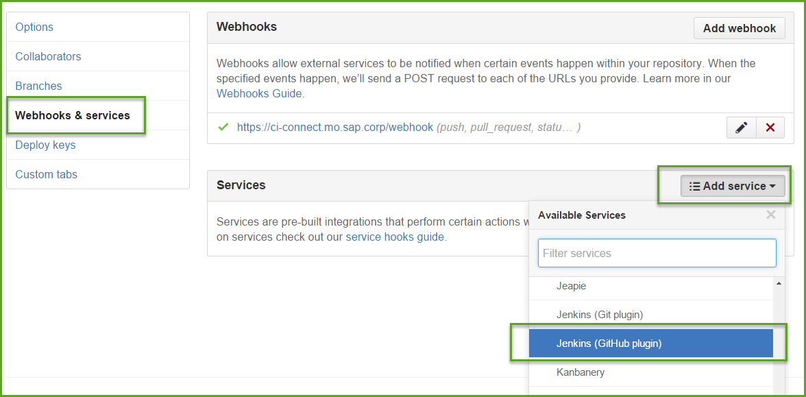
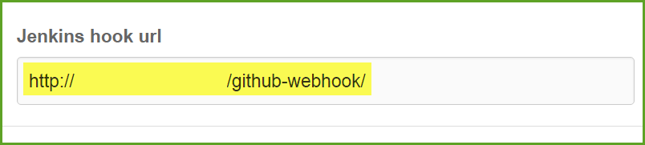
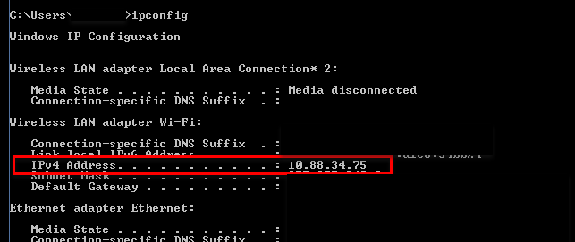

# Use Github Webhook: Build when a change is pushed to Github
##Content 
In this exercise you are going to create a webhook in your GitHub repository. By checking in a change in the repository, your Jenkins job which uses the repository as a source will be started. 

There are generally two ways of triggering a Jenkins build through a push in GitHub. Either you can configure the Jenkins GitHub Plugin, so Jenkins manage the webhook automatically, or you can manually add a webhook in your GitHub without using the plugin. If you are using the VirtualBox now to house your Jenkins server, using the GitHub plugin will not work because your Jenkins URL is not determined.  To check out how to use the [GitHub Plugin](https://wiki.jenkins-ci.org/display/JENKINS/GitHub+Plugin)
and learn more about the pros and cons from the two ways, please visit our [ASE Wiki page](https://wiki.wdf.sap.corp/wiki/display/ASE/Build+when+a+change+is+pushed+to+GitHub).

The following steps will walk you through the setting up of webhook manually.  

- Go to the repository you are going to use in the Jenkins job(`e.g.cc-bulletinboard-ads-cd`).  Click "Settings".

- Go to "Webhooks & Services", click "Add service", select"Jenkins (GitHub plugin)"

- Type your Jenkins URL  `http://<your Jenkins URL>:9090/github-webhook/`, click "Add service".

  - *find the Jenkins URL*: If you are using jenkins from VirtualBox, you will have to give the ip of your host computer as the URL of the Jenkins.Open the `Command Prompt` in your **host machine**. Run `ipconifg`, mark the `IPv4 Address` and copy it.

