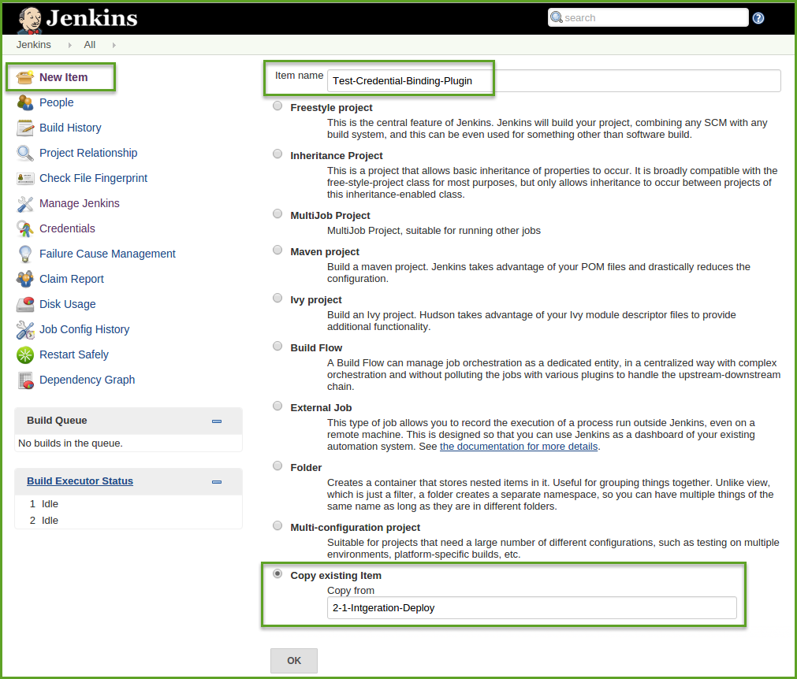
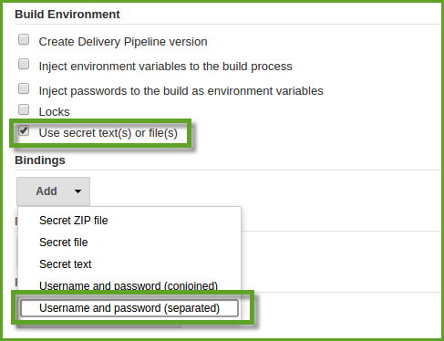
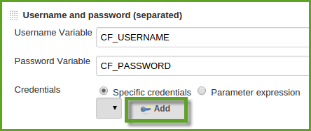
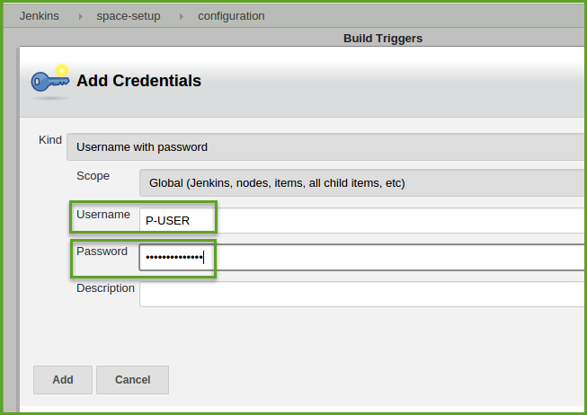
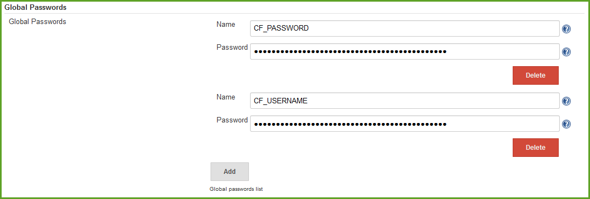
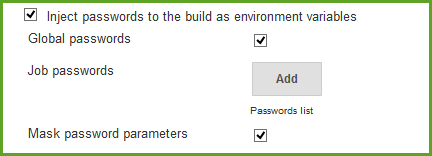
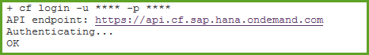

#Handle the Credentials
In the previous exercises, you have tried to log in in the Cloud Foundry by using `cf login -u <CF_USERNAME> -p <CF_PASSWORD>`. To expose the credentials like this is not what we want.
The following exercise will guide you through two different ways to handle credentials. 
## Use Credentials-Binding Plugin
### Step 1: Install Credential-Binding plugin
- If you haven't installed the plugin yet, go to Jenkins->Manage Jenkins->Manage Plugins->Available. Search for `	
Credentials Binding Plugin`. 
### Step 2: Set up your job
- Create a new job `Test-Credential-Binding-Plugin` through copying your job `2-1-Integration-Deploy`. 

- Find `Use secret text(s) or file(s)` in the `Build Evironment` of your job configuration.
- Check the box and add `Username and password(separated)`.

- Enter `CF_USERNAME` and `CF_PASSWORD` as variables and then click `Add` button.
- 
- Enter the username and password in the following pop-up window

- You can now select the credentials you created in the dropdown list of `Specific credentials`
- Change the log in part of your codes into following.(You will have to adjust the `<place-holder>`) 

```
cf login -u $CF_USERNAME -p $CF_PASSWORD -a https://api.cf.sap.hana.ondemand.com -o <your-org-name> -s <your-space-name>
```
- Save the job and run it. Check the console output of the build. Can you find your user and password? (Search `login` to find it)
You can see although you have avoided to put the name and password directly into the command lines, you can still see them in the logs.


## Use EnvInject Plugin
This way of handling plugin will save your user name and password as environment variables and inject them into your build. It also solves the problem of showing the credentials in the console by masking the variables.
- Open your Jenkins Configuration (Jenkins -> Manage Jenkins -> Configure System)
- In section "Global Passwords", click "Add" to generate a new variable. Fill in the name (Name) of the variable and its content (Password).

- Create a new job `Test-EnvInject-Plugin` through copying your job `2-1-Integration-Deploy`.
- In section "Build Environment", mark "Inject passwords to the build as environment variables", check "Global passwords" and "Mask your password parameters"

- Change the log in part of your codes into following.(You will have to adjust the `<place-holder>`) 
```
cf login -u $CF_USERNAME -p $CF_PASSWORD -a https://api.cf.sap.hana.ondemand.com -o <your-org-name> -s <your-space-name>
```
- Save the job and run it. Check the console output of the build. Can you find your user and password? (Search `login` to find it). 
- You can see the credentials is no longer visible inside the logs.

