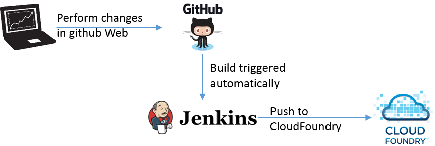
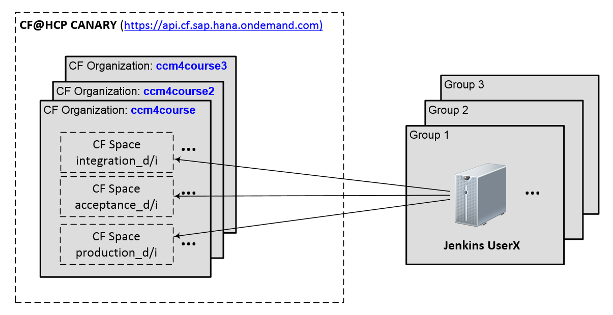

#M4 Pilot 1 – Exercises – Supplement Sheet

##General

Jenkins Server: http://localhost:9090

P-User name/psw:___________________________________

Your CF-Org: ____________________

Your spaces:

- integration_`d/i-number`
- acceptance_`d/i-number`
- production_`d/i-number`

Your App-Routes:
- `https://`bulletinboard-ads-integration-`d/i-number`.cfapps.sap.hana.ondemand.com/api/v1.0/ads
- `https://`bulletinboard-ads-acceptance-`d/i-number`.cfapps.sap.hana.ondemand.com/api/v1.0/ads
- `https://`bulletinboard-ads-production-`d/i-number`.cfapps.sap.hana.ondemand.com/api/v1.0/ads

Your app on Nexus: 
- `https://`nexus.wdf.sap.corp:8443/nexus/#nexus-search;quick~com.sap.cc.course.team`d/i-number`

##How we work

##Overview – CF Organizations and Spaces

