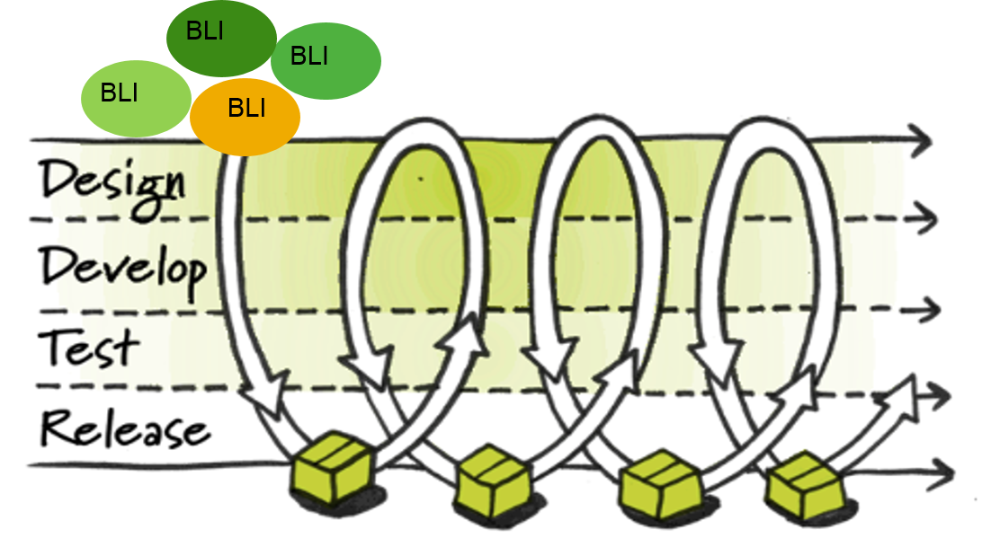

# Continuous Delivery & DevOps 

##List of Course Materials:
- [Course Information](README.md)
- [Presentations](Presentations)
- [Exercises](Exercises)
- [Application Repository](https://github.wdf.sap.corp/cc-java/cc-bulletinboard-ads-cd)

##Websites and Tools used in the Course:
- [Monsoon Dashboard](https://monsoon.mo.sap.corp/organizations/sandbox)
- [Kibana]( https://logs.cf.sap.hana.ondemand.com)
- [SAP CF@HCP Cockpit](https://hcp-cockpit.cfapps.sap.hana.ondemand.com/cockpit)
- [Uptime Monitor](https://uptime.neo.ondemand.com/doc)
- [Bridge](https://bridge.mo.sap.corp/#/)
- [CI Connect](https://ci-connect.mo.sap.corp/)
- [Cloud Foundry Cheat Sheet](Z_Forms/CS_Merged.pdf)

##More Information:
- [Continuous Delivery Wiki](https://wiki.wdf.sap.corp/wiki/pages/viewpage.action?pageId=1563161749)
- [Cloud Curriculum Jam Page](https://jam4.sapjam.com/groups/about_page/zAfXdXPcJGlCUrBScXSWKP)

