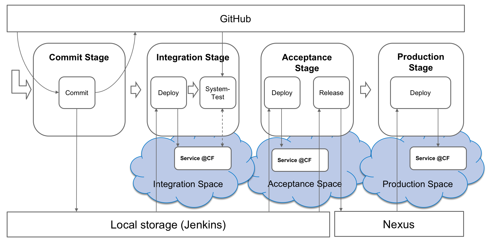

# Course Material: Continuous Delivery & DevOps 

## Goals

#### Implement Continuous Delivery and DevOps
* Learn to design and setup CD pipeline and DevOps infrastructure  
* Learn to operate CD pipeline, operate DevOps infrastructure  
* Learn to operate/run Cloud Application & apply DevOps methods, using monitoring, usage measurement, logging, tracing, feature toggles,…   

## Course Outline 

##### 1. Introduction / Overview Cloud, Continuous Delivery, DevOps

##### 2. Introduction Cloud Foundry, Jenkins and Ruby

##### 3. Design & Setup CD Pipeline
- Design CD Pipeline & Done Criteria per CD stage
- Setup CD Pipeline
  - Cloud Foundry (organization, space, service plan), Jenkins, Ruby
  - Infrastructure-as-Code

##### 4. Operate CD Pipeline
- From CI to CD
- Qualify existing microservice-based cloud application across the CD Pipeline
- Test Automation, Continuous Integration, Quality metrics, Product Standards, etc.
- Release cloud application application into production
- Manual/Automated release, Continuous Deployment vs Delivery with/without Feature Toggle
- Deployment techniques, e.g. Blue/Green, Canary

##### 5. Operate Cloud Application
- Monitoring, Logging & Tracing  
  - Application Monitoring, Usage Monitoring  
  - Infrastructure Monitoring
- Incident handling  
  - Application level, e.g. Bug in V1.0 of software artifact -> BugFix -> CD Pipeline -> Release V1.1  
  - Infrastructure level, e.g. Health issue in CF (e.g. Too much load backing service) -> Alerting -> manual and/or automated adaptation

## Prerequisites
- The prerequisites for the course can be found here: [Prerequisites.md](Prerequisites.md)

## Exercises

- [Preparations and initial steps](Exercises/Exercise-Preparation_And_Initial_Steps.md)
- [CI Job in Commit Stage](Exercises/Exercise-CI_In_Commit_Stage.md)
- [Integration Stage-Part1](Exercises/Exercise-Integration_Stage_Part1.md)
- [Integration Stage-Part2](Exercises/Exercise-Integration_Stage_Part2.md)
- [Job Orchestration](Exercises/Exercise-Job_Orchestration.md)
- [Automated Versioning](Exercises/Exercise-Automated_Versioning.md)
- [Acceptance Stage-Part1](Exercises/Exercise-Acceptance_Stage_Part1.md)
- [Acceptance Stage-Part2](Exercises/Exercise-Acceptance_Stage_Part2.md)
- [Production Stage-Part1](Exercises/Exercise-Production_Stage_Part1.md)
- [Production Stage-Part2](Exercises/Exercise-Production_Stage_Part2.md)
- [Quality Metrics](Exercises/Exercise-Quality_Metrics.md)
- [Dashboards / Jenkins Views](Exercises/Exercise-Dashboards_Jenkins_Views.md)
- [Bridge Traffic Light](Exercises/Exercise-Bridge_Traffic_Light.md)
- [Create Jenkins server on Monsoon](Exercises/Exercise-Create_Jenkins_On_Monsoon.md)
- [Infrastructure as Code (Spaces, service bindings, user/ role per environment yml files)](Exercises/Exercise-Infrastructure_As_Code_SpaceServiceRoles.md)
- [Uptime Monitor](Exercises/Exercise-Uptime_Monitor.md)
- [Kibana-Part1](Exercises/Exercise-Kibana_Part1.md)
- [Kibana-Part2](Exercises/Exercise-Kibana_Part2.md)
- [CI-Connect](https://github.wdf.sap.corp/ci-connect/cc-m4-coursematerial-ci-connect)

