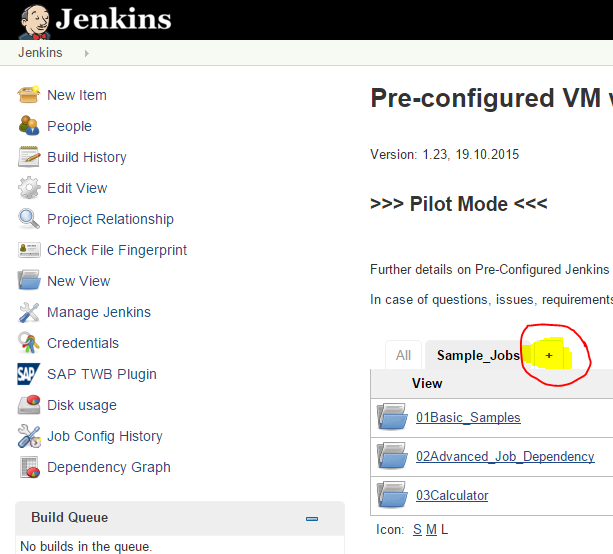
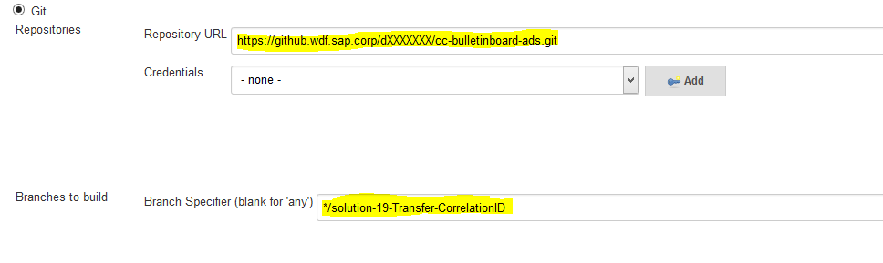
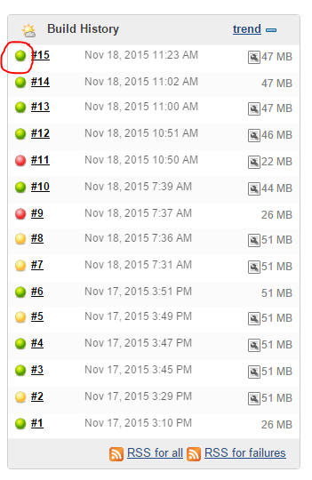
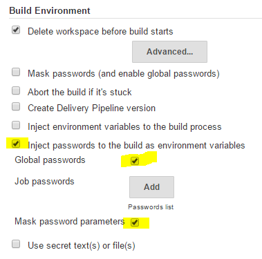
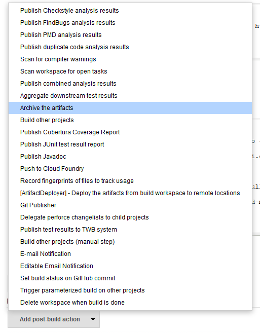
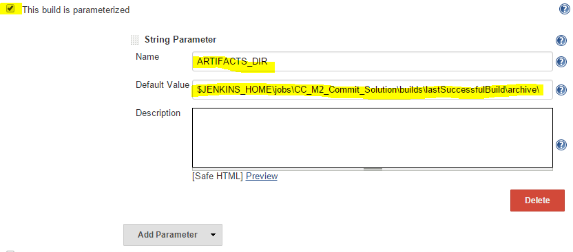
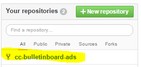
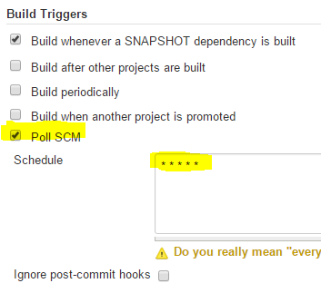
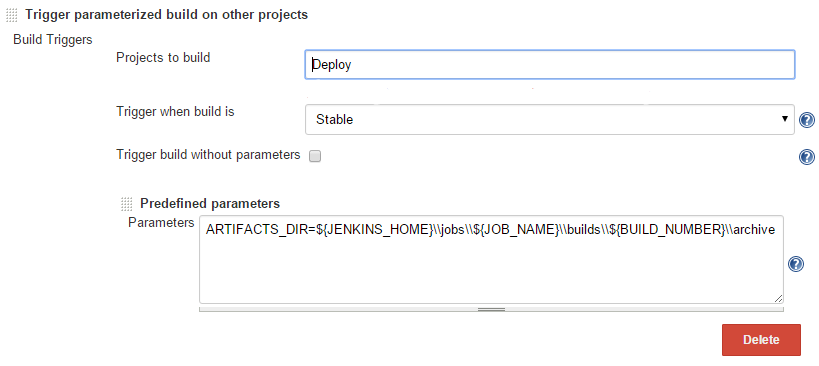

#Exercise - Setup CD Pipeline

##Learning Goal
The goal of this exercise is to setup a minimal CD pipeline consisting of 2 stages with Jenkins


##Prerequisites

1. Build groups of three
2. Get a group number
3. Fork the project [`cc-bulletinboard-ads`](https://github.wdf.sap.corp/cc-java/cc-bulletinboard-ads). [`Here`](https://wiki.wdf.sap.corp/wiki/display/ASE/GitHub+Fork) you can find how to do that (Step 8 is not required)
4. Navigate to your Jenkins server: `http://veecfseqos0XX:8080/jenkins/` (replace `XX` with your group number )

##Step 1: Create new view
* Click on the plus to create a new view



* Select `List View` and give the name `CD-Pipeline`. Then press the `OK` button
* Keep the default values and press the `OK` button
 
##Step 2: Create commit job 
* On the upper left side click on `New Item`
* Select `Maven project` and give the name `Commit`
* Press the `OK` button
* Configure the job:
  * As JDK version select `jdk1.8.0_20`
  * In section `Source Code Management` select the radio button `Git` and enter the HTTPS-Link to your forked GitHub project and specify the branch `solution-19-Transfer-CorrelationID`.
 
  * In the `Build` section, define `clean package` as `Goals and options`
* Save the job

##Step 3: Start job and analyze log
* On the left side click on `Build Now` to start the job and see whether it works or not
* Open the console log by clicking on the highlighted circle:

 

##Step 4: Create deploy job - Prepare login to CloudFoundry
* Navigate to the view you have created (`CD-Pipeline`)
* Again, press on `New Item` to create a new job
* Select `Freestyle project` and give the name `Deploy`
* Configure the job:
  * In the `Build Environment` section select the check box `Inject passwords to ...`
  * Also check `Global passwords` (In Global Jenkins settings, we setup a user account and password to be used in the exercise) 
  * Ensure that the check box `Mask password parameters` is active! (This masks the password in the console output)
   


* In section `Build` press the button `Add Buildstep` and select `Windows Batch Command` and copy/paste the following code:
```console
cf --version
cf login -u %CF_USERNAME% -p %CF_PASSWORD% -a https://api.cf.neo.ondemand.com -o ccm4course -s teamX
```
* Save the job
* Run the job (like Step 3)

##Step 5: Deploy job - Prepare push to CloudFoundry
* On the left side of the window select `Configure` 
* Copy the following code and append it to the `Build Step`:
```console
cf services
cf create-service postgresql-lite free postgres-bulletinboard-ads
cf create-service rabbitmq-lite free bulletinboard-mq
cf push -n bulletinboard-ads-teamX
```
* Save and run the job
* Analyze the log output
* Hint: The job will fail because its working directory is empty. This means we have to copy the built artifact to the deploy job workspace.


##Step 6: Pass artifacts between jobs
Now we're going to archive the built artifacts. This allows another job to safely access those artifacts, without the risk of the commit job's workspace being modified at the same time. 

Configure the `Commit` job:
* In section `Post-build Actions` add `Archive the artifacts`

* Enter `target/*.war,manifest*.yml` as files to archive
* Save and run the `Commit` job


##Step 7: Add an archive directory parameter to the deploy job
In order to use the archived files from the `Commit` job within the `Deploy` job, we need to add an archive directory parameter.

* Configure the `Deploy` job
* Check the box `This build is parameterized`
* Add a String parameter
* Set name to `ARTIFACTS_DIR`
* Set default value to `$JENKINS_HOME\jobs\<name of commit job>\builds\lastSuccessfulBuild\archive`.  This uses the artifacts from the last successfull `Commit` job.



* To copy the stored artifact `bulletinboard-ads.war` and the `manifest.yml` from `${ARTIFACTS_DIR}/target` copy the following code and insert it at the beginning of the `Windows Batch Command`

```
mkdir target

copy %ARTIFACTS_DIR%\target\bulletinboard-ads.war target\
copy %ARTIFACTS_DIR%\manifest.yml .
```
* Save and run the job
* Hint: The job will fail because the hostname (url), which is defined in the manifest.yml, is already in use.

##Step 8: Define unique hostname in manifest.yml and push the app
* Open [`GitHub`](https://github.wdf.sap.corp/) in your browser
* Login if you are not
* On the right side of the window click on your repository


* As branch, select `solution-19-Transfer-CorrelationID`
* Click on the file `manifest.yml`
* Push the "pen-button" to edit the file
* As a new line below the `name`, insert `  hostname: bulletinboard-ads-teamX` (replace `X` with your group number ) 
* Press the button `Commit Changes` - this saves your changes
* Trigger the `Commit` job in order to make the changes available in Jenkins and wait until the job is successfully completed
* Trigger the `Deploy` job
* Open a browser and check whether the app under `http://bulletinboard-ads-teamX.cfapps.neo.ondemand.com/` (replace `X` with your group number ) is up and running and returns `OK`
* If the hostname is not taken from manifest.yml, you can append it to `cf push -n <hostname>`


##Step 9: Trigger the Commit job automatically after changes in GitHub project
* Configure your `Commit` job
* In section `Build Triggers` check `Poll SCM` and enter `* * * * *` in the text field. This will trigger a poll every minute
   
* Save


##Step 10: Trigger the Deploy-Job automatically after successful Commit-Job
* Configure your `Commit` job
* In section `Post-build Action` add the post-build action `Trigger parameterized build on other projects`:
  * Projects to build `Deploy`
  * Select `Add Parameters` - `Predefined parameters`
  * Add parameter `ARTIFACTS_DIR=${JENKINS_HOME}\\jobs\\${JOB_NAME}\\builds\\${BUILD_NUMBER}\\archive` to the `Predefined parameters`. This overwrites the default value given in Step 7. Here, instead of giving the artifact from the last successful build, we use the artifact from the current `Commit` job (with unique number ´${BUILD_NUMBER}´).    
  
* Save


##Step 11: Make a code change and check whether your pipeline works
* Like in step 8 where you modified the `manifest.yml` file, change the string returned in the class `src/main/java/com/sap/bulletinboard/ads/resources/DefaultResource.java`

